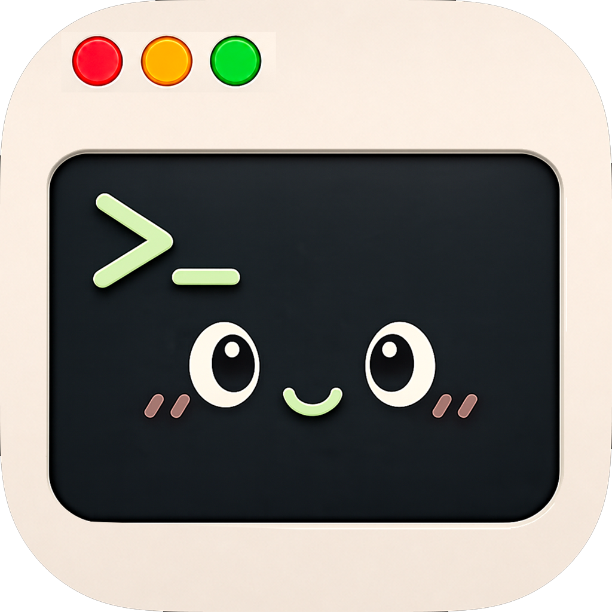

[English](README.md)

<p align="center">
  
</p>

# Mytty

**はじめての方は[チュートリアル](docs/README_ja.md#チュートリアル)から。**

## 概要

Mytty は AI を使う開発作業に合わせた、Apple Silicon 専用の macOS ネイティブターミナルです。Metal によるターミナル描画には libghostty、周辺 UI には AppKit、SwiftUI、WebKit を使用しています。ターミナルを主役にしたまま、タブ、ペイン、エージェントの状態表示、通知パネル、作業用ツールを追加し、workspace のような別の管理概念は導入しません。

Codex、Claude Code、OpenCode、Antigravity(スタンドアロンの Gemini CLI を含む)、Cursor に対応しています。各連携はペインごとの Unix socket へ構造化イベントを送り、人向けのターミナル出力を解析せずに、要求元のペインとエージェントの状態を対応付けます。

現在のリリースは macOS 15 以降、Apple Silicon に対応しています。

## 特徴

- **Ghostty のターミナルエンジン:** libghostty による描画、ネイティブ IME、theme、フォント、カーソル、透明度、外観の設定。
- **タブとペイン:** 4方向への分割、挿入位置を表示するドラッグ並べ替え、ペインズーム、均等割り当て、全ペインスイッチャー。分割中のタブでは、非アクティブ側を暗くするのに加えてアクティブなペインを枠線で囲む(色と太さは設定可能)。タブにはサイドバーで番号が振られ、Command-1〜9 で直接ジャンプできる。新規タブは末尾か、現在のタブの直後かを選べる(Settings)。
- **エージェント状態表示と通知パネル:** アクティブなエージェント、セッションコスト、quota メーター、承認・入力・完了・失敗を発生元のペインへ直接ジャンプできる形で溜める通知パネル。
- **AI からの操作(`mytty-ctl`):** どのペインからも事前設定なしで使えるローカル CLI。エージェントがペインを開き、操作し、結果を読み取れるので、サブエージェントのチームは隠れたバックグラウンド処理ではなく普通の見えるペインとして動く。使い方一式は `mytty-ctl guide` で読める。mytty 以外のプロジェクトからでも同じように使える。Claude Code と Codex には、それぞれのグローバル設定に短いポインタを書き込むことでこの機能を自分で見つけさせることもできる(Settings のトグル、デフォルトオン)。
- **セッション復元、ローカル autocomplete、アプリ内ブラウザ、GIF 録画、iOS リモートアプリ**(Attention 項目の APNs push 通知つき)。

それ以外のすべては[ドキュメント](docs/README_ja.md)にあります。チュートリアル、使い方、リファレンス、各部分の設計判断まで揃っています。

## スクリーンショット

### タブとペイン


### `mytty-ctl` による AI からの操作


### GIF 録画


### iOS リモート

<p align="center">
  
  
</p>

## ドキュメント

詳細なドキュメントは [`docs/`](docs/README_ja.md) 配下にあり、4つの区分に分かれています。

- [チュートリアル](docs/README_ja.md#チュートリアル): 実際に使いながら覚える
- [使い方](docs/README_ja.md#もっと進んだ使い方): 特定の作業の手順
- [リファレンス](docs/README_ja.md#リファレンス): 設定・コマンド・プロトコルの正確な仕様
- [説明](docs/README_ja.md#説明): なぜその仕組みになっているか

## ビルド方法

ビルドの前提条件、libghostty のセットアップ、テスト、アプリバンドル化は [macOS アプリをソースからビルドする](docs/how-to/build-macos-app_ja.md)を、タグベースの release 手順は [バージョンをリリースする](docs/how-to/release-a-version_ja.md)を参照してください。

```sh
git submodule update --init --recursive
scripts/build-ghostty.sh
swift test
swift run Mytty
```

## License

MIT
