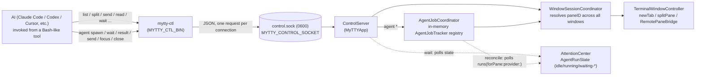
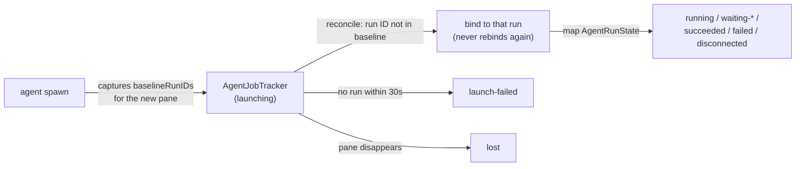

# mytty-ctl architecture

日本語版は [mytty-ctl-architecture_ja.md](mytty-ctl-architecture_ja.md) にあります。

This page explains why `mytty-ctl` can drive Mytty's panes over a socket at all, why it works with no setup step, and how its `agent` orchestration commands bind a job to the exact worker run it spawned. For the command reference and usage patterns, see `docs/reference/mytty-ctl.md`; this page stays focused on the mechanism underneath it.

## Why one socket is enough

`mytty-ctl` is a local CLI that lets AI agents such as Claude Code, Codex, and Cursor operate Mytty itself: creating and splitting panes, sending input, reading the screen, and waiting on agent state. Unlike an invisible subagent spawned through `Task`/`Agent`, a teammate driven through `mytty-ctl` is a real pane on screen that the user can watch and step into at any time.



The transport is deliberately a separate line from the iOS remote (`RemoteAccessServer`, TCP plus pairing plus encryption). `mytty-ctl` talks to exactly one Unix domain socket under `ApplicationPaths.aiControlSocket`, scoped to the same-user local process by mode `0600` (the parent directory is `0700` too). There is no pairing and no encryption. A local process running as the same user could already do everything this socket allows by driving CGEvent directly, so layering authentication or encryption on top of the socket would not add real defense, only ceremony. The iOS remote sits on the other side of that line: it is a network connection from outside the trust boundary, so it gets pairing and encryption that the local control socket deliberately skips. The asymmetry is a choice that matches each channel's threat model, not an oversight in one of them.

The dev build (`Mytty Dev`) and the release build each use their own socket under `~/.config/mytty(-dev)`. `mytty-ctl` itself has no idea which one it is talking to; that is entirely decided by the environment variables described below.

Every request lands on `ControlServer` (`MyTTYApp`), `WindowSessionCoordinator` resolves the pane ID across all open windows, and `TerminalWindowController` performs the actual split or text send. This is the same convergence described in [architecture.md](architecture.md): every entry point ends up calling the same application-level commands, so a pane split by `mytty-ctl` and a pane split from a menu item go through the identical code path rather than two that could quietly drift apart.

## Why no setup is needed

Every time Mytty opens a new pane, it sets three environment variables in that pane's shell automatically (`AgentEventServer.environment(for:)`). This is the same mechanism `mytty-agent-hook` relies on to find `MYTTY_EVENT_SOCKET`, reused as-is for the control socket.

| Variable | Meaning |
| --- | --- |
| `MYTTY_CONTROL_SOCKET` | Absolute path to the Unix socket `mytty-ctl` connects to |
| `MYTTY_CTL_BIN` | Absolute path to the `mytty-ctl` binary (no `PATH` entry required) |
| `MYTTY_SURFACE_ID` | This pane's own pane ID (usable as `<self>`) |

Because all three are already set the moment a pane opens, an AI running inside a Mytty pane can start operating other panes using its own pane ID with no install step and no config file to write first:

```bash
"$MYTTY_CTL_BIN" split "$MYTTY_SURFACE_ID" right --cwd /path/to/worktree
```

If `mytty-ctl` happens to be on `PATH`, plain `mytty-ctl` works too.

This only holds together because the environment variables are injected once, at process start, rather than something the CLI has to go looking for in a config file. The agent-hook mechanism (`docs/reference/agent-event-protocol.md`) and the control socket share the same "hand out environment variables when a pane opens" pattern; that is not a coincidence, it is the same pattern Mytty already uses for agent integration, applied again to the control channel.

## Why there is no resident orchestrator

The lead is whichever AI is currently talking to the user in the current pane; there is no dedicated, always-running orchestrator process. The lead calls `mytty-ctl` from a Bash-like tool and fans out waits on multiple panes using something like `run_in_background: true`, letting its own harness's completion notifications drive the next step. The `wait` subcommand blocks by polling `AttentionCenter`'s `AgentRunState` until it resolves, so the lead never has to write its own polling loop.

The upside of this shape is that if the lead exits or crashes, there is no resident process holding state that could leave orphaned panes behind as zombies; a pane that stops hearing from its lead is still just a pane. The tradeoff the lead needs to keep in mind is that `wait --until attention` will block until timeout for Cursor and Antigravity, since those providers' hooks never emit approval or input-waiting events, and that `wait` blocks until timeout the same way whenever the target provider's hook has not been enabled in Settings yet, since no agent events arrive at all in that case. See "`wait` semantics" in `docs/reference/mytty-ctl.md` for the full detail.

## Why agent jobs need their own binding

`agent wait`/`agent result`/`agent send` all resolve a job ID rather than a pane ID. That extra layer exists because a pane ID alone can't answer "is this still the run I spawned" -- a pane persists across however many processes run in it, but a job means one specific spawn of one specific worker. Without something in between, `wait --until completed` after a future feature reused a pane could resolve immediately from whatever run was already sitting in that pane, before the new work even started.

`AgentJobCoordinator` (`MyTTYApp`) owns the in-memory job registry and is the `ControlServerAgentDelegate` `ControlServer` calls into for every `agent` request -- kept as its own delegate protocol rather than folded into `ControlServerDelegate`, since job operations resolve through tracked state first while pane operations resolve straight to a `TerminalWindowController`. It creates the worker's pane through the same `TerminalWindowController.splitPane` path any other split uses (with a transient `initialInput` carrying the launch command plus task -- never persisted into `TerminalSurfaceState`, so a restored session never replays it; the line itself is prefixed with `AgentLaunchPlan.historySuppressionPrefix`, which unsets `HISTFILE` inside the pane's shell because macOS's `/etc/zshrc` sets it unconditionally and environment scrubbing therefore can't keep the spawn line out of `~/.zsh_history`, plus a leading space for `inc_append_history` setups where the write happens before the unset but `hist_ignore_space` drops space-prefixed lines), and on every subsequent `agent` call it re-derives that job's state by calling the pure `AgentJobTracker.reconcile` (`MyTTYCore`) against a fresh read of `AttentionCenter.runs(forPane:provider:)` -- a narrow query added specifically for this, returning plain `AgentRun` values rather than `AttentionCenter`'s whole mutable `runs` dictionary.



The binding rule itself is deliberately simple and independent of `AttentionCenter`'s own "most relevant run" heuristic (which is tuned for the status bar, not for "which run does this job own"): a job records the run IDs already present for its pane at creation time (normally none, since `agent spawn` always creates a new pane rather than reusing one), and binds to the first later run for that pane and provider whose ID isn't in that set. Once bound, it never switches runs. This is what keeps two jobs spawned back to back from ever cross-binding even though `AttentionCenter` has no notion of "which job asked" -- each `AgentJobTracker` filters and picks independently, from its own baseline.

The job registry itself is not persisted, unlike `TerminalSurfaceState`. A Mytty restart loses every job ID that was ever issued -- `agent wait`/ `agent result`/etc. against one of them then returns `job-not-found` -- while leaving the panes and worker processes those jobs pointed at running exactly as before. This mirrors the "no resident orchestrator" tradeoff above: state that only matters while some lead process is still around to use it doesn't need to survive an app restart, and not persisting it means there's no stale-job-registry migration to get wrong later.

## References

- `docs/reference/mytty-ctl.md`: command reference and usage patterns, including the `agent` failure codes and job/run binding summary
- `docs/how-to/orchestrate-agents-with-mytty-ctl.md`: staged multi-worker examples built on the `agent` commands
- `docs/reference/agent-event-protocol.md`: the environment variables and event protocol agent hooks use (the same "hand out env vars on pane open" pattern as the control socket)
- `.claude/skills/mytty-panes/SKILL.md`: the same mechanism packaged as a ready-to-use skill
