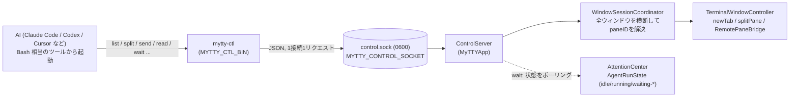

# mytty-ctl のアーキテクチャ

English version is [mytty-ctl-architecture.md](mytty-ctl-architecture.md).

このページは、なぜ `mytty-ctl` がソケット越しにペインを操作できるのか、そして
なぜ事前セットアップなしでいきなり使えるのかを説明する。コマンドリファレンスや
ユースケースは `docs/reference/mytty-ctl.md` にまとめてあり、ここでは「動く仕組み」の方に
絞る。

## ソケット一本で足りる理由

`mytty-ctl` は Claude Code や Codex、Cursor といった AI エージェントが Mytty
自身を操作するためのローカル CLI で、ペインの作成・分割・入力送信・画面読み取り・
エージェント状態の待機ができる。`Task`/`Agent` のような画面に出てこない
サブエージェントと違い、`mytty-ctl` が操作するチームメンバーは実際のペインとして
画面に見え、ユーザーが横から介入できる。



トランスポートは iOS リモート(`RemoteAccessServer`、TCP + ペアリング + 暗号化)
とは意図的に別系統にしてある。`mytty-ctl` が使うのは
`ApplicationPaths.aiControlSocket` 配下の Unix ドメインソケット 1 本だけで、
パーミッション `0600`(親ディレクトリも `0700`)によって同一ユーザーのローカル
プロセスだけに閉じている。ペアリングや暗号化は行っていない。同一ユーザーの
ローカルプロセスは、CGEvent などを使えばそもそも同等の操作がすでにできる立場に
あるため、ソケットの側でそれ以上の認証や暗号化を積んでも実質的な防御にはならない
と判断した。iOS リモートは信頼境界の外にあるネットワーク越しの接続なので、
そちらには別途ペアリングと暗号化を用意している。この非対称さは手抜きではなく、
それぞれの脅威モデルに合わせた結果になっている。

dev ビルド(`Mytty Dev`)とリリースビルドはそれぞれ別の `~/.config/mytty(-dev)`
配下のソケットを使う。`mytty-ctl` 自体はどちらのソケットを叩くか意識しない。
接続先は後述の環境変数で決まる。

要求はすべて `ControlServer`(`MyTTYApp`)が受け、`WindowSessionCoordinator`
が全ウィンドウを横断して pane ID を解決し、実際の分割やテキスト送信は
`TerminalWindowController` が担う。これは
[architecture_ja.md](architecture_ja.md) で説明した「すべてのエントリポイントが
同じアプリケーションレベルのコマンドに収束する」という設計の一部で、
`mytty-ctl` から split したペインとメニューから split したペインが違う経路を
通ることはない。

## セットアップ不要で使える理由

Mytty は新しいペインを開くたびに、そのペインのシェル環境に以下を自動で
設定する(`AgentEventServer.environment(for:)`)。`mytty-agent-hook` が
`MYTTY_EVENT_SOCKET` を読むのと同じ仕組みを、制御用のソケットについても
そのまま流用している。

| 環境変数 | 意味 |
| --- | --- |
| `MYTTY_CONTROL_SOCKET` | `mytty-ctl` が接続する Unix ソケットの絶対パス |
| `MYTTY_CTL_BIN` | `mytty-ctl` バイナリの絶対パス(`PATH` 登録不要) |
| `MYTTY_SURFACE_ID` | このペイン自身の pane ID(`<self>` として使える) |

この 3 つがペインを開いた瞬間から揃っているため、Mytty のペイン内で動く AI は
インストール作業や設定ファイルの用意なしに、自分自身の pane ID を使って
他のペインを操作し始められる。

```bash
"$MYTTY_CTL_BIN" split "$MYTTY_SURFACE_ID" right --cwd /path/to/worktree
```

`PATH` に `mytty-ctl` を通してある場合は `mytty-ctl` とだけ書いてもよい。

裏を返すと、この仕組みが成立するのは環境変数がプロセスの起動時に一度だけ注入
されるからであり、ソケットパスやバイナリパスをどこかの設定ファイルに書いて
探しに行かせる必要がない。エージェントフック(`docs/reference/agent-event-protocol.md`)と
制御ソケットが同じ「ペインを開いたときに環境変数を配る」という仕組みを共有して
いるのは偶然ではなく、Mytty がエージェント連携全体で採用しているパターンを
制御用チャネルにもそのまま適用した結果になっている。

## 常駐オーケストレーターを置かない設計

司令塔は「今ユーザーと話しているペインの AI」自身であり、専用の常駐
オーケストレータープロセスは存在しない。司令塔は `mytty-ctl` を Bash 相当の
ツールから呼び、複数ペインの完了待ちは Bash の `run_in_background: true` で
並列に投げて、ハーネスの完了通知に任せる形で組み立てる。`wait` サブコマンドが
`AttentionCenter` の `AgentRunState` をポーリングして返るまでブロックするため、
司令塔側は自前でポーリングループを書く必要がない。

この設計だと、司令塔が終了したりクラッシュしたりしても、常駐プロセスとして
状態を持ち続けるものが存在しないので、外れたペインがゾンビ化して残り続ける
心配がない。反面、`wait --until attention` は Cursor と Antigravity の
フックが承認・入力待ちイベントを出さないためタイムアウトするまで返らない、
対象プロバイダーの hook が Settings で有効化されていない環境ではエージェント
イベントが一切飛んでこずやはりタイムアウトまでブロックし続ける、といった
制約は司令塔側で認識しておく必要がある。詳しくは `docs/reference/mytty-ctl.md` の
「`wait` の意味論」を参照。

## 参考

- `docs/reference/mytty-ctl.md`: コマンドリファレンスとユースケース集
- `docs/reference/agent-event-protocol.md`: エージェントフックが使う環境変数とイベント
  プロトコル(制御ソケットと同じ「ペイン起動時に環境変数を配る」パターン)
- `.claude/skills/mytty-panes/SKILL.md`: 上記の仕組みをそのまま使える
  スキルとしてまとめたもの
