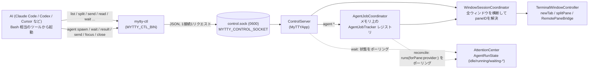
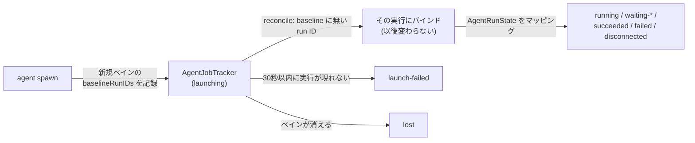

# mytty-ctl のアーキテクチャ

English version is [mytty-ctl-architecture.md](mytty-ctl-architecture.md).

このページは、なぜ `mytty-ctl` がソケット越しにペインを操作できるのか、なぜ事前セットアップなしでいきなり使えるのか、そして `agent` オーケストレーションコマンドがどうやって job を spawn した worker の実行そのものにバインドするのかを説明する。コマンドリファレンスやユースケースは `docs/reference/mytty-ctl.md` にまとめてあり、ここでは「動く仕組み」の方に絞る。

## ソケット一本で足りる理由

`mytty-ctl` は Claude Code や Codex、Cursor といった AI エージェントが Mytty 自身を操作するためのローカル CLI で、ペインの作成・分割・入力送信・画面読み取り・エージェント状態の待機ができる。`Task`/`Agent` のような画面に出てこないサブエージェントと違い、`mytty-ctl` が操作するチームメンバーは実際のペインとして画面に見え、ユーザーが横から介入できる。



トランスポートは iOS リモート(`RemoteAccessServer`、TCP + ペアリング + 暗号化)とは意図的に別系統にしてある。`mytty-ctl` が使うのは `ApplicationPaths.aiControlSocket` 配下の Unix ドメインソケット 1 本だけで、パーミッション `0600`(親ディレクトリも `0700`)によって同一ユーザーのローカルプロセスだけに閉じている。ペアリングや暗号化は行っていない。同一ユーザーのローカルプロセスは、CGEvent などを使えばそもそも同等の操作がすでにできる立場にあるため、ソケットの側でそれ以上の認証や暗号化を積んでも実質的な防御にはならないと判断した。iOS リモートは信頼境界の外にあるネットワーク越しの接続なので、そちらには別途ペアリングと暗号化を用意している。この非対称さは手抜きではなく、それぞれの脅威モデルに合わせた結果になっている。

dev ビルド(`Mytty Dev`)とリリースビルドはそれぞれ別の `~/.config/mytty(-dev)` 配下のソケットを使う。`mytty-ctl` 自体はどちらのソケットを叩くか意識しない。接続先は後述の環境変数で決まる。

要求はすべて `ControlServer`(`MyTTYApp`)が受け、`WindowSessionCoordinator` が全ウィンドウを横断して pane ID を解決し、実際の分割やテキスト送信は `TerminalWindowController` が担う。これは [architecture_ja.md](architecture_ja.md) で説明した「すべてのエントリポイントが同じアプリケーションレベルのコマンドに収束する」という設計の一部で、`mytty-ctl` から split したペインとメニューから split したペインが違う経路を通ることはない。

## セットアップ不要で使える理由

Mytty は新しいペインを開くたびに、そのペインのシェル環境に以下を自動で設定する(`AgentEventServer.environment(for:)`)。`mytty-agent-hook` が `MYTTY_EVENT_SOCKET` を読むのと同じ仕組みを、制御用のソケットについてもそのまま流用している。

| 環境変数 | 意味 |
| --- | --- |
| `MYTTY_CONTROL_SOCKET` | `mytty-ctl` が接続する Unix ソケットの絶対パス |
| `MYTTY_CTL_BIN` | `mytty-ctl` バイナリの絶対パス(`PATH` 登録不要) |
| `MYTTY_SURFACE_ID` | このペイン自身の pane ID(`<self>` として使える) |

この 3 つがペインを開いた瞬間から揃っているため、Mytty のペイン内で動く AI はインストール作業や設定ファイルの用意なしに、自分自身の pane ID を使って他のペインを操作し始められる。

```bash
"$MYTTY_CTL_BIN" split "$MYTTY_SURFACE_ID" right --cwd /path/to/worktree
```

`PATH` に `mytty-ctl` を通してある場合は `mytty-ctl` とだけ書いてもよい。

裏を返すと、この仕組みが成立するのは環境変数がプロセスの起動時に一度だけ注入されるからであり、ソケットパスやバイナリパスをどこかの設定ファイルに書いて探しに行かせる必要がない。エージェントフック(`docs/reference/agent-event-protocol.md`)と制御ソケットが同じ「ペインを開いたときに環境変数を配る」という仕組みを共有しているのは偶然ではなく、Mytty がエージェント連携全体で採用しているパターンを制御用チャネルにもそのまま適用した結果になっている。

## 常駐オーケストレーターを置かない設計

司令塔は「今ユーザーと話しているペインの AI」自身であり、専用の常駐オーケストレータープロセスは存在しない。司令塔は `mytty-ctl` を Bash 相当のツールから呼び、複数ペインの完了待ちは Bash の `run_in_background: true` で並列に投げて、ハーネスの完了通知に任せる形で組み立てる。`wait` サブコマンドが `AttentionCenter` の `AgentRunState` をポーリングして返るまでブロックするため、司令塔側は自前でポーリングループを書く必要がない。

この設計だと、司令塔が終了したりクラッシュしたりしても、常駐プロセスとして状態を持ち続けるものが存在しないので、外れたペインがゾンビ化して残り続ける心配がない。反面、`wait --until attention` は Cursor と Antigravity のフックが承認・入力待ちイベントを出さないためタイムアウトするまで返らない、対象プロバイダーの hook が Settings で有効化されていない環境ではエージェントイベントが一切飛んでこずやはりタイムアウトまでブロックし続ける、といった制約は司令塔側で認識しておく必要がある。詳しくは `docs/reference/mytty-ctl.md` の「`wait` の意味論」を参照。

## agent の job に専用のバインディングが要る理由

`agent wait`/`agent result`/`agent send` はいずれも pane ID ではなく job ID を解決する。この層がわざわざ挟まっているのは、pane ID だけでは「これは自分が spawn したのと同じ実行か」に答えられないから。ペインはその中で何個プロセスが走ろうと存続し続けるが、job は特定の worker の特定の1回の起動を指す。この層が無いと、将来ペインを使い回すような機能が入ったとき、`wait --until completed` が新しい作業が始まる前からそのペインに残っていた実行状態でいきなり解決してしまいかねない。

`AgentJobCoordinator`(`MyTTYApp`)がメモリ上の job レジストリを持ち、`ControlServer` があらゆる `agent` リクエストで呼び出す `ControlServerAgentDelegate` の実体になっている。`ControlServerDelegate` に統合せず別の delegate プロトコルにしてあるのは、job 操作が最初に追跡状態を経由するのに対し、ペイン操作は直接 `TerminalWindowController` に解決するという違いがあるため。worker のペイン自体は、他の split と同じ `TerminalWindowController.splitPane` の経路を通って作られる(起動コマンドとタスクを載せた一時的な `initialInput` を渡すが、これは `TerminalSurfaceState` には一切永続化されないので、復元されたセッションがそれを再生することはない)。以降の `agent` 呼び出しのたびに、純粋関数である `AgentJobTracker.reconcile`(`MyTTYCore`)を、その時点の `AttentionCenter.runs(forPane:provider:)` の読み取り結果に対して呼び出し、job の状態をその都度再導出する。この `runs(forPane:provider:)` は、`AttentionCenter` の可変な `runs` 辞書をそのまま渡すのではなく、この用途のために追加した狭いクエリで、プレーンな `AgentRun` の配列を返す。



バインディングのルール自体は、`AttentionCenter` 自身の「最も関連度の高い実行」というヒューリスティック(ステータスバー向けに調整されたもので、「この job が持っている実行はどれか」という問いには合わない)とは無関係に、意図的に単純にしてある。job は作成時点でそのペインに既に存在する実行 ID(通常は無い。`agent spawn` は既存ペインを使い回さず必ず新しいペインを作るため)を記録しておき、そのペイン/provider について後から観測した実行のうち、ID がその集合に含まれない最初の実行にバインドする。一度バインドすると、別の実行に切り替わることはない。`AttentionCenter` 自体は「どの job が問い合わせているか」を知らないが、それでも連続して spawn した2つの job が互いの実行に誤ってバインドすることはない。各 `AgentJobTracker` が自分自身の baseline から独立してフィルタと選択を行っているため。

job レジストリ自体は `TerminalSurfaceState` と違って永続化されない。Mytty を再起動すると、それまでに発行された job ID はすべて失われ、以後その job ID に対する `agent wait`/`agent result` などは `job-not-found` を返すようになる。一方で、それらの job が指していたペインやワーカープロセスはそのまま動き続ける。これは上で説明した「常駐オーケストレーターを置かない」という判断と同じ考え方で、司令塔プロセスが生きている間だけ意味を持つ状態はアプリ再起動をまたいで生き残る必要がなく、永続化しないことで後から古い job レジストリの移行処理を書く必要も生まれない。

## 参考

- `docs/reference/mytty-ctl.md`: コマンドリファレンスとユースケース集。`agent` の失敗コードと job/実行バインディングの要点も含む
- `docs/how-to/orchestrate-agents-with-mytty-ctl_ja.md`: `agent` コマンドを使った複数 worker の段階的な例
- `docs/reference/agent-event-protocol.md`: エージェントフックが使う環境変数とイベントプロトコル(制御ソケットと同じ「ペイン起動時に環境変数を配る」パターン)
- `.claude/skills/mytty-panes/SKILL.md`: 上記の仕組みをそのまま使えるスキルとしてまとめたもの
