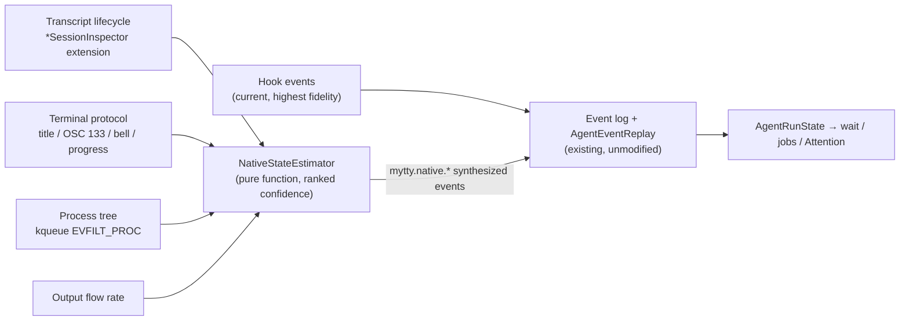

# Design study: native pane observation for orchestration

日本語版は [native-orchestration-design_ja.md](native-orchestration-design_ja.md) にあります。

This page is a design study; nothing described here is implemented yet. The current implementation is what [mytty-ctl-architecture.md](mytty-ctl-architecture.md) and [agent-event-protocol.md](../reference/agent-event-protocol.md) describe. The intent is to carve out individual changes from here as parts of the design get adopted, so this page collects the reasoning and the skeleton of the design in one place.

## Motivation

Today's orchestration rests on two helper binaries: `mytty-agent-hook`, invoked from provider hook configuration to deliver state events, and `mytty-ctl`, the CLI a lead agent uses to drive panes. The arrangement works well, but the hook approach carries two structural constraints.

The first is the installation wall. Hooks require writing into a provider's own global configuration (`~/.claude/settings.json` and friends), which in practice grants "run arbitrary code in every session of that provider" — so `mytty-ctl integration enable` deliberately puts a human confirmation dialog in the way. That is the right safety call, but its flip side is that until the hook is installed no state is visible at all, and `wait` fails immediately with `provider-integration-not-installed`.

The second is coverage. Providers without a hook integration (Antigravity, for instance) and providers whose hooks never emit approval events (Cursor) leave parts of the state permanently invisible.

Meanwhile, every pane runs inside Mytty. Mytty owns each pane's PTY and already holds the byte stream in both directions, the foreground process, and the screen contents. From that position, a large share of agent state should be observable natively, without hooks — that observation is the starting point of this study.

## Prior art: herdr

herdr, a Rust terminal multiplexer built for coding agents, solves the same problem with a two-tier detection scheme.

- Lifecycle hooks: the agent reports its own state to herdr's local socket. High fidelity, but requires `herdr integration install` — the same shape as Mytty's hook integration.
- Screen manifests: herdr periodically reads the terminal buffer and infers state from UI patterns using declarative per-agent-kind rules (TOML). Zero setup, lower fidelity, and blocked detection is deliberately strict so running agents don't get misclassified.

The notable data point is that herdr runs Claude Code on screen manifests alone. There is a latency of a few seconds, but conservative rules evidently reach practical accuracy. At the same time, herdr's state rollup mostly feeds an at-a-glance dashboard; it is not wired into notifications, an attention inbox, and `agent wait` resolution the way Mytty's state is, so the bar for being wrong is lower there.

## What the "no screen scraping" principle actually covers

The principle in [architecture.md](architecture.md) reads:

> Agent state is derived from versioned, idempotent events delivered by explicit hooks or by libghostty's own terminal protocol support. [...] Human-readable terminal output is never parsed to infer state.

Read closely, what is banned is parsing human-readable output — regexing display strings like `Waiting for approval`. Terminal protocol (title changes, bell, OSC 133, progress reports) is explicitly on the allowed side. Reading transcripts that the provider itself writes as structured logs is not screen parsing either; the `*SessionInspector` family already does exactly that for model names and context budgets.

So of all the signals proposed below, only herdr-style screen rules actually collide with the principle. Everything else fits inside it as written.

## Proposal: signal fusion

The central idea is to not build a second state machine for native observation. Instead, observed signals get synthesized into `AgentEvent`s and injected into the existing event log and reducer (`AgentEventReplay`). `AgentEvent.hookName` already reserves the `mytty.` prefix for events Mytty synthesizes itself, with `mytty.cursorApprovalPending` (the delay-based Cursor approval estimate) as the precedent. Native signals would arrive as synthesized events named `mytty.native.*`.

The payoff of this shape is that everything downstream works unmodified. `wait` resolution, `AgentJobTracker` job binding, and Attention Inbox derivation all consume the `AgentRunState` the reducer produces; none of them need to care whether an event came from a hook or from synthesis.

### Signal layers and confidence

Signal sources get a confidence ranking, and synthesis from lower layers is suppressed while a higher layer is alive for the pane.

1. Hook events. Kept as-is as the highest-fidelity source, but no longer required — they become an optional accuracy upgrade.
2. Transcript lifecycle. `ClaudeCodeSessionInspector` / `CodexSessionInspector` / `CursorSessionInspector` already read each provider's transcript (JSONL, SQLite). Today they extract only the model name and context budget, but the kind of the trailing record can also yield running, probably-awaiting-approval, and success or failure. A transcript is the provider's own event log, so fidelity close to hooks is realistic.
3. Terminal protocol. `GhosttySurfaceEvent` already carries `titleChanged` and `commandFinished` (OSC 133, with exit code). Bell (`GHOSTTY_ACTION_RING_BELL`) and progress reports exist in libghostty's C API; receiving them is a matter of adding cases to `GhosttyRuntime`'s action switch, with no Ghostty patch involved. Claude Code and Codex can ring the bell on completion and on approval requests, which makes it a raw attention signal.
4. Process tree. `AgentStatusPollingCoordinator` currently detects the foreground process by polling every 0.5 seconds (`TerminalAgentProcessDetector`). kqueue's `EVFILT_PROC` (`NOTE_EXEC` / `NOTE_FORK` / `NOTE_EXIT`) can deliver agent process start and exit and tool-subprocess forks event-driven. This layer detects the facts corresponding to hook SessionStart / SessionEnd reliably, without touching any configuration.
5. Output flow rate. Bytes flowing means generating; sustained silence suggests idle. Too weak on its own, so it only corroborates the other layers.

Fusion itself lives in a pure function along the lines of a `NativeStateEstimator`: signal sequences in, synthesized event sequences out. Being testable as an input/output table, without the running app, is a design requirement — the same bar the reducer already meets.

### Conservative attention detection

The lesson to take from herdr is an asymmetry: a false blocked (approval or input waiting) detection does more damage than a missed running one. In Mytty the asymmetry bites harder. A falsely detected approval request puts a bogus item in the Attention Inbox, fires a notification, and wrongly resolves an orchestrator's `wait --until attention`. The inbox's signal-to-noise ratio is the product, so attention states are synthesized only when multiple layers agree, and not at all when confidence falls short. The existing philosophy of leaving state at `unknown` rather than guessing carries over as the suppression rule for synthesis.

### Expected effects

- Launch, running, and finished states become visible, approximately, for every provider — including panes where no hook was ever installed.
- `wait` stops being hook-gated, softening the immediate `provider-integration-not-installed` failure (responses could carry a marker that the state is estimated).
- Hook installation becomes an optional step for people who want maximum fidelity, so the human confirmation dialog stops being a first-run barrier.
- Stronger job binding. `AgentJobTracker` currently binds by run-ID baseline difference; if an inspector can identify the session file created after the spawn, binding gains a sturdier identity.

## Screen rules, both sides

Whether to add herdr-style declarative screen rules as a fifth signal is left undecided in this study. The arguments stay side by side.

Reasons to adopt:

- They are the only way to cover providers with neither hooks nor transcripts (Antigravity, and future tools). None of the four layers above reaches this long tail.
- herdr demonstrates practical accuracy with conservative rules, running Claude Code on screen manifests alone.
- Rules are data rather than code, so tracking a provider's UI changes needs no app rebuild.

Reasons to pass:

- Display strings change without notice across provider versions and locales. The reasons the principle excluded this approach in the first place still stand.
- Rule maintenance is a running cost. herdr has a community fixing manifests; Mytty is a single-maintainer project.
- It sits poorly with the current test setup of pure functions plus fixtures, since it implies keeping golden screen captures per provider version.
- The major providers already have transcripts, a higher-fidelity source, so the range where screen rules genuinely add value is narrow.

If adopted, containment is the condition: pinned to the lowest confidence rank, never evaluated on panes where a better source is producing state, never generating Attention items directly (only synthesizing transitions after the screen has been stable for several seconds), and switchable off per provider.

## The control channel side

Unlike state observation, driving panes requires an input channel from the lead; that cannot go to zero. Three directions were considered for shrinking or replacing `mytty-ctl`.

- Option A: an MCP server built into Mytty. Exposing pane operations as MCP tools would replace Bash-driven CLI calls with typed tool calls. But registering an MCP server requires writing into provider configuration, which contradicts this study's "works without touching configs" motivation. Low priority.
- Option B: in-band control sequences. The agent in a pane writes a private OSC to its own stdout, and Mytty, owning the PTY, intercepts it in GhosttyAdapter. The lowest-level path — not even environment variables needed — but the reply channel is the problem: injecting responses into stdin collides with the foreground TUI, so request/response round-trips don't fit. Fire-and-forget self-reports like `mytty-ctl status` fit well.
- Option C: declarative orchestration. Instead of the lead issuing low-level operations one by one, it hands over a single declaration — "N workers of this provider on this task, tell me when they finish" — and Mytty owns spawn, state watching, retries, and result aggregation natively. The CLI doesn't disappear, but the surface the lead touches, and the care it must take (the 64 KiB limit, assembling waits), shrinks substantially.

The current recommendation is option C as the backbone, with option B limited to replacing status self-reports. Additionally, the push-style state subscription herdr's socket API offers (a held-open connection streaming state changes, a `subscribe`) is worth adding to the control protocol as a future extension complementing today's polling-based `wait`.

## Staged adoption

If this moves to implementation, the stages below each deliver standalone value, in order.

1. Terminal-protocol signals (adding the bell and progress cases) and process-tree observation feeding a `NativeStateEstimator`, and the start of `mytty.native.*` event synthesis. At this point hook-less launch/running/finished detection works for every provider.
2. Transcript lifecycle derivation in the claude / codex / cursor inspectors, raising fidelity for success, failure, and approval waits. The session-file approach to job binding belongs here too.
3. Control-side improvements: relaxing `wait`'s hook precondition, adding `subscribe`, and `agent spawn --worktree` (creating the worktree and spawning in one step).
4. Screen rules. The adoption decision is deferred to this stage, once the measurements from 1–3 show how much of the long-tail gap actually remains.

## Open questions

- Screen rule adoption. As argued above; deciding after stages 1–3 reveal the remaining gap is the realistic path.
- The long-term position of hooks. This study assumes coexistence (hooks as an optional upgrade), not removal — the immediacy and certainty of approval-wait detection is something only hooks deliver.
- Presentation of estimated state. Whether hook-derived and estimated states should be distinguished in the UI (status bar wording, a confidence marker on `wait` responses) is undesigned.

## References

- [mytty-ctl-architecture.md](mytty-ctl-architecture.md): the current control socket and agent job binding
- [agent-event-protocol.md](../reference/agent-event-protocol.md): the hook event wire format
- [agent-providers.md](../reference/agent-providers.md): per-provider lifecycle mapping and data sources
- [architecture.md](architecture.md): the "no screen scraping" principle, as written
