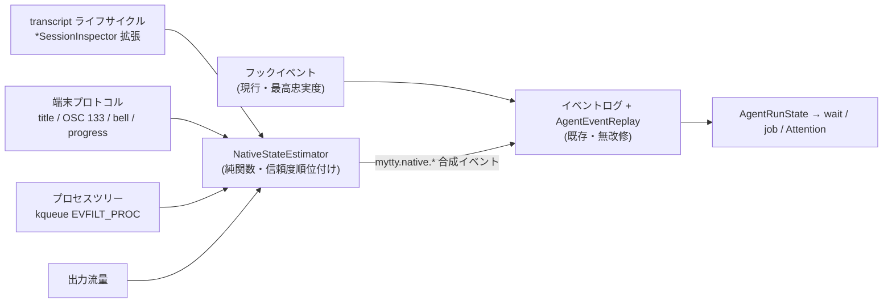

# ネイティブ観測によるオーケストレーション設計案

English version is [native-orchestration-design.md](native-orchestration-design.md).

このページは設計検討の記録であり、ここに書かれている仕組みはまだ実装されていません。現行の実装は [mytty-ctl-architecture_ja.md](mytty-ctl-architecture_ja.md) と [agent-event-protocol_ja.md](../reference/agent-event-protocol_ja.md) が説明しているとおりです。採用が決まった部分から個別の変更として切り出していく前提で、判断材料と設計の骨格をまとめています。

## 動機

現行のオーケストレーションは 2 つの補助バイナリに支えられています。プロバイダーのフック設定から呼ばれて状態イベントを届ける `mytty-agent-hook` と、リード役のエージェントがペインを操作するための CLI である `mytty-ctl` です。この構成はよく動いていますが、フック方式には構造的な制約が 2 つあります。

1 つ目はインストールの壁です。フックはプロバイダー自身のグローバル設定(`~/.claude/settings.json` など)への書き込みを必要とし、それは事実上「そのプロバイダーの全セッションで任意コードを実行する」許可なので、`mytty-ctl integration enable` は人間の確認ダイアログを挟みます。安全のための設計ですが、裏返すとフックが入るまでは状態が一切見えず、`wait` は `provider-integration-not-installed` で即失敗します。

2 つ目はカバレッジです。フック連携を実装していないプロバイダー(Antigravity など)や、フックはあっても承認待ちイベントを出さないプロバイダー(Cursor)では、状態の一部が原理的に届きません。

一方で、すべてのペインは Mytty の中で動いています。Mytty は各ペインの PTY を所有し、バイト流の出入り、フォアグラウンドプロセス、画面内容をすでに握っています。この立場を使えば、フックに頼らずにエージェント状態のかなりの部分をネイティブに観測できるはずだ、というのがこの検討の出発点です。

## 先行事例: herdr

同じ問題を解いているツールとして herdr(Rust 製のエージェント用ターミナルマルチプレクサ)を参照しました。herdr は状態検出を 2 段構えにしています。

- ライフサイクルフック。エージェント自身が herdr のローカルソケットに状態を報告する方式で、精度は高いものの `herdr integration install` が必要です。Mytty のフック連携と同じ構図です。
- 画面マニフェスト。ターミナルバッファを定期的に読み、エージェント種別ごとの宣言的ルール(TOML)で UI パターンから状態を推測します。セットアップ不要ですが精度は落ち、blocked 判定は running を誤分類しないよう意図的に厳格にしてあります。

注目すべきは、herdr が Claude Code を画面マニフェストだけで運用していることです。数秒の遅延はあるものの、保守的なルールにすれば実用になるという実績がここにあります。同時に、herdr の状態表示は「ダッシュボードで眺める」用途が主で、Mytty のように通知・Attention Inbox・`agent wait` の解決条件へ直結してはいない、という要求水準の違いも読み取れます。

## 「画面をスクレイピングしない」原則の射程

[architecture_ja.md](architecture_ja.md) の原則は次のように書かれています。

> エージェント状態は、明示的なフックか libghostty 自体の端末プロトコルサポートが配信する、バージョン管理された冪等なイベントから導出されます。人間可読な端末出力を解析して状態を推測することは一切しません。

読み直すと、禁止されているのは「人間可読な出力の解析」、つまり `Waiting for approval` のような表示文字列を正規表現で拾うことだけです。端末プロトコル(タイトル変更、ベル、OSC 133、進捗報告)は許可側に明記されています。プロバイダー自身が構造化ログとして書く transcript を読むことも、`*SessionInspector` 群がモデル名とコンテキスト残量のためにすでにやっているとおり、画面の解析ではありません。

つまり、この後で提案する信号のうち原則と衝突するのは herdr 式の画面ルールだけで、それ以外はすべて現行の原則の枠内に収まります。

## 提案: 信号融合アーキテクチャ

中心となるアイデアは、ネイティブ観測のために新しい状態機械を作らないことです。代わりに、観測した信号から `AgentEvent` を合成し、既存のイベントログとリデューサー(`AgentEventReplay`)に注入します。`AgentEvent.hookName` には Mytty 自身が合成するイベント用の `mytty.` プレフィックスがすでに仕様化されていて、Cursor の承認待ち推定(`mytty.cursorApprovalPending`)という前例もあります。ネイティブ信号は `mytty.native.*` を名乗る同種の合成イベントになります。

この形にする利点は、下流が無改修で動くことです。`wait` の解決、`AgentJobTracker` の job バインド、Attention Inbox の導出は、どれもリデューサーが出す `AgentRunState` しか見ていないので、イベントの出所がフックか合成かを区別する必要がありません。

### 信号層と信頼度

信号源には信頼度の順位を付け、上位の信号が生きているあいだ下位からの合成を抑制します。

1. フックイベント。現行のまま最高忠実度の情報源として残しますが、必須ではなくなり、精度を上げるためのオプションという位置づけに変わります。
2. transcript ライフサイクル。`ClaudeCodeSessionInspector` / `CodexSessionInspector` / `CursorSessionInspector` はすでに各プロバイダーの transcript(JSONL、SQLite)を読んでいます。現在はモデル名とコンテキスト残量だけを取り出していますが、末尾レコードの種別を見れば running・承認待ちの可能性・成否まで導出できます。transcript はプロバイダー自身のイベントログなので、フックに次ぐ忠実度が期待できます。
3. 端末プロトコル。`GhosttySurfaceEvent` には `titleChanged` と `commandFinished`(OSC 133、exit code 付き)がすでにあります。ベル(`GHOSTTY_ACTION_RING_BELL`)と進捗報告は libghostty の C API に存在していて、`GhosttyRuntime` の action 分岐に case を足すだけで受け取れます。Ghostty へのパッチは不要です。Claude Code や Codex は完了時や承認要求時にベルを鳴らす設定を持つので、attention 検出の生の信号になります。
4. プロセスツリー。`AgentStatusPollingCoordinator` は 0.5 秒ごとのポーリングでフォアグラウンドプロセスを検出しています(`TerminalAgentProcessDetector`)。kqueue の `EVFILT_PROC`(`NOTE_EXEC` / `NOTE_FORK` / `NOTE_EXIT`)を使えば、エージェントプロセスの起動と終了、ツール実行の子プロセス生成をイベント駆動で拾えます。フックの SessionStart / SessionEnd に相当する事実を、設定に一切触れず確実に検出できる層です。
5. 出力流量。PTY にバイトが流れていれば生成中、一定時間無音なら idle 候補、という補助信号です。単独では弱いので、他の層の裏付けにだけ使います。

融合そのものは `NativeStateEstimator` のような純関数に閉じ込め、信号列を入力に取り合成イベント列を返す形にします。リデューサーと同じく、実アプリなしで入出力の対応表としてテストできることを設計の条件にします。

### 保守的な attention 判定

herdr から持ち帰るべき教訓は、blocked(承認待ち・入力待ち)の誤検出は running の見逃しより害が大きい、という非対称性です。Mytty ではこの非対称性がさらに強く効きます。誤検出された承認待ちは Attention Inbox に偽のアイテムを積み、通知を飛ばし、オーケストレーターの `wait --until attention` を誤って解決させるからです。Inbox の信号対雑音比は製品の看板そのものなので、ネイティブ信号からの attention 判定は複数の層が一致したときだけ合成する、確度が足りなければ合成しない、という保守的な側に倒します。状態が分からないときに `unknown` のままにするという現行の哲学は、合成の抑制条件としてそのまま引き継ぎます。

### 期待できる効果

- フック未インストールのプロバイダーでも、起動・実行中・終了の近似状態が全プロバイダーで見えるようになります。
- `wait` がフック前提でなくなり、`provider-integration-not-installed` での即失敗を緩和できます(推定ベースである旨を応答に含める形が考えられます)。
- フックのインストールは「精度を上げたい人がやる任意の一手間」になり、人間確認ダイアログの存在が新規ユーザーの障壁ではなくなります。
- job バインドの強化。`AgentJobTracker` は現在 run ID の baseline 差分でバインドしていますが、inspector が「spawn 後に新規作成された session ファイル」を特定できれば、より頑丈な同一性でバインドできます。

## 画面ルールの両論

herdr 式の宣言的画面ルールを第 5 の信号として持つかどうかは、この検討では決めていません。判断材料を両論のまま残します。

採用する理由になりうるもの:

- フックも transcript もないプロバイダー(Antigravity や将来の新ツール)を拾える唯一の手段です。上の 4 層はどれもこのロングテールには届きません。
- herdr が Claude Code を画面ルールだけで運用している実績があり、保守的なルールなら実用精度が出ることは確認されています。
- ルールがコードではなくデータ(宣言的マニフェスト)なので、プロバイダーの UI 変更にはアプリの再ビルドなしで追従できます。

見送る理由になりうるもの:

- 表示文字列はプロバイダーのバージョンやロケールで予告なく変わります。原則がこの方式を最初から外していた理由はそのままです。
- ルールの保守は継続コストです。herdr にはマニフェストを直すコミュニティがありますが、Mytty は個人メンテナンスのプロジェクトです。
- 純関数とフィクスチャで固めている現在のテスト構成と相性が悪く、プロバイダーバージョンごとの画面キャプチャをフィクスチャとして抱えることになります。
- 主要プロバイダーには transcript というより忠実度の高い情報源がすでにあり、画面ルールが本当に価値を出す範囲は狭いです。

採用する場合は封じ込めを条件にします。信頼度は最下位に固定し、より良い情報源が状態を出しているペインでは評価しない、Attention アイテムを直接生成しない(画面が数秒安定した後の状態遷移としてだけ合成する)、プロバイダー別に無効化できるスイッチを持つ、という制約です。

## 制御チャネル側の検討

状態観測と違って、ペインの操作にはリードからの入力チャネルが必ず必要で、これをゼロにはできません。`mytty-ctl` の置き換え・縮小には 3 つの方向を検討しました。

- 案 A: Mytty 内蔵の MCP サーバー。ペイン操作を MCP ツールとして公開すれば、エージェントは Bash 経由の CLI ではなく型付きのツール呼び出しで操作できます。ただし MCP サーバーの登録にはプロバイダー設定への書き込みが必要で、「設定に触れずに動く」というこの検討の動機と矛盾します。優先度は低いと判断しました。
- 案 B: 帯域内(in-band)の制御シーケンス。ペイン内のエージェントが自分の stdout に私用 OSC を書き、PTY を所有する Mytty が GhosttyAdapter で横取りする方式です。環境変数すら不要になる最もローレベルな経路ですが、応答をどう返すかという問題があります。stdin への注入はフォアグラウンドの TUI と衝突するため、要求と応答の往復には向きません。`mytty-ctl status` のような応答不要の自己報告には適しています。
- 案 C: 宣言的オーケストレーション。リードが低レベル操作を逐一発行するのではなく、「このタスクでこのプロバイダーの worker を N 個、終わったら知らせる」という宣言を 1 回渡し、spawn・状態監視・再試行・結果集約は Mytty がネイティブ側で担う形です。CLI は消えませんが、リードが触る表面積と、64 KiB 制限や wait の組み立てといった配慮事項が大きく減ります。

現時点の推奨は案 C を主軸に、案 B を status 自己報告の置き換えに限定して組み合わせることです。また herdr の socket API が持つ状態イベントの push 購読(接続を張りっぱなしにして状態変化を流す `subscribe`)は、ポーリングで実装されている現行の `wait` を補完する将来拡張として control protocol に足す価値があります。

## 段階的な導入案

実装に進む場合の刻み方です。各段階が独立に価値を持つ順に並べています。

1. 端末プロトコル信号(ベル・進捗の case 追加)とプロセスツリー観測を `NativeStateEstimator` に集め、`mytty.native.*` 合成イベントの注入を始める。この時点でフックなしの起動・実行中・終了検出が全プロバイダーで動きます。
2. transcript ライフサイクルの導出を claude / codex / cursor の inspector に足し、成否と承認待ちの忠実度を上げる。job バインドの session ファイル方式もここで検討します。
3. 制御側の改善。`wait` のフック前提の緩和、`subscribe` の追加、`agent spawn --worktree`(worktree を作ってから spawn する一体化)など。
4. 画面ルール。採否の判断はこの段階まで先送りし、1〜3 の実測でロングテールの穴がどれだけ残るかを見てから決めます。

## 未解決の論点

- 画面ルールの採否。上の両論のとおりで、1〜3 の実装後に残る穴の大きさで判断するのが現実的です。
- フックの長期的な位置づけ。この検討ではオプション化(併存)を前提にしていて、廃止は目標にしていません。承認待ちの即時性と確実性はフックにしか出せないためです。
- 推定由来の状態の表示。フック由来と推定由来を UI 上で区別するか(ステータスバーでの表記、`wait` 応答への確度の付与など)は未設計です。

## 参考資料

- [mytty-ctl-architecture_ja.md](mytty-ctl-architecture_ja.md): 現行の制御ソケットと agent job バインドの仕組み
- [agent-event-protocol_ja.md](../reference/agent-event-protocol_ja.md): フックイベントのワイヤーフォーマット
- [agent-providers_ja.md](../reference/agent-providers_ja.md): プロバイダーごとのライフサイクル対応表と情報源
- [architecture_ja.md](architecture_ja.md): 「画面をスクレイピングしない」原則の原文
