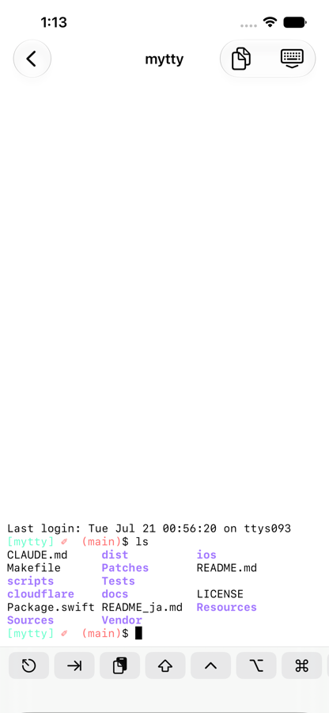
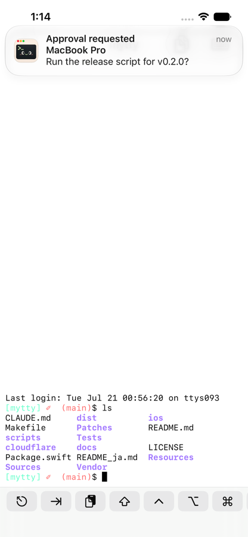

# iPhone から Mac に接続する

MyttyRemote という iOS アプリを使って Mac の Mytty に iPhone や iPad からアクセスできます。

## iPhone をペアリングする

iOS との連携は、Mac 側で **設定 > iOS Remote Access** から行います。

## iPhone からペインを操作する

  

iPhone アプリで接続するとタブやペインを参照できます。

ペインの内容は Mac 側と同期されます。表示されている内容をコピーしたい場合は、右上のボタンで今のペインの内容を別に表示することで行えます。

## Attention をプッシュ通知で受け取る

  

ペアリング済みであれば、通知の項目は Apple Push Notification service 経由で iPhone にも届きます。Mytty が最前面で、かつ通知を出すペインがアクティブなときは通知が送られません。

このプッシュを中継するのは Cloudflare Worker(`cloudflare/push-relay`)で、iOS をビルドして使う場合はご自身の Apple Developer team で iOS アプリをビルドし、この Worker の自己ホストが必須となります。手順は [`cloudflare/push-relay/README.md`](../../cloudflare/push-relay/README.md) を参照。
