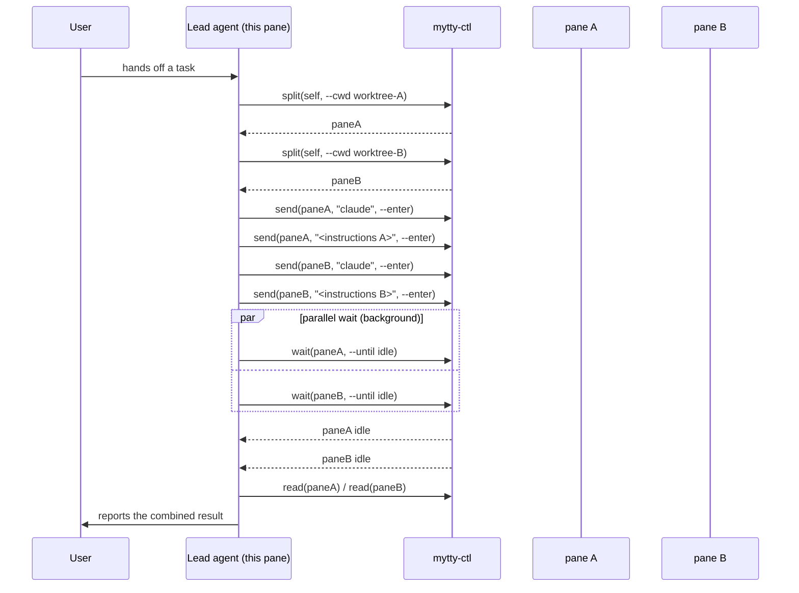
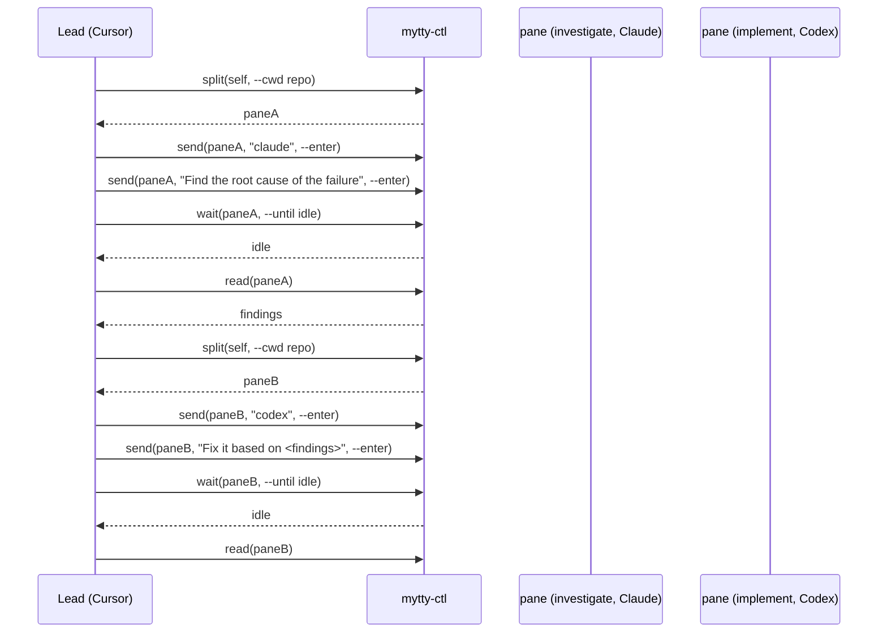
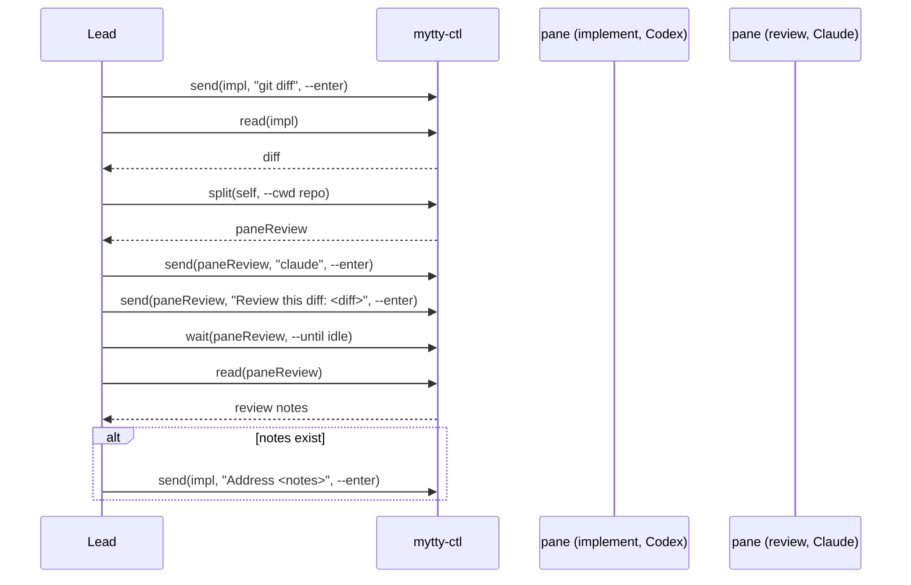
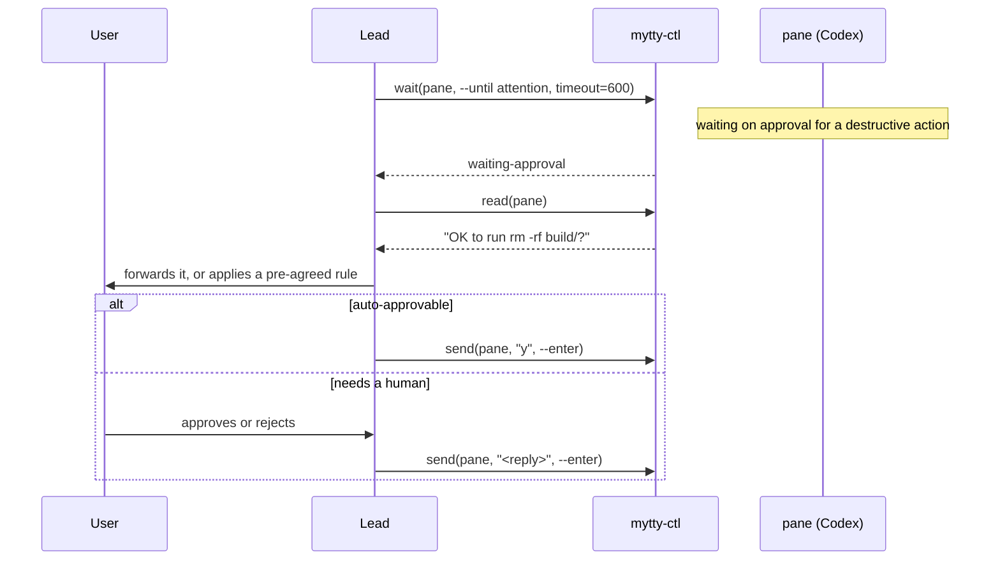

# Orchestrate a team of agents with mytty-ctl

`mytty-ctl` is a local CLI that lets an AI agent running in one pane open,
split, and drive other panes. This is how to use it to run a small team of
subagents that stay visible and interruptible, rather than the kind of
invisible subagent a `Task`/`Agent` tool spawns.

No setup is required inside a Mytty pane: every pane gets
`MYTTY_CONTROL_SOCKET`, `MYTTY_CTL_BIN`, and `MYTTY_SURFACE_ID` in its shell
environment automatically, so an agent can call `"$MYTTY_CTL_BIN" split
"$MYTTY_SURFACE_ID" right` without anyone wiring anything up first. The full
command list and JSON output shapes are documented separately in
[mytty-ctl command reference](../reference/mytty-ctl.md); this page is about
the shapes of work that are worth building with it.

## The shape of a run

There is no standing orchestrator process. The "lead" is whichever agent is
already talking to the user in the current pane. It calls `mytty-ctl` the
same way it would call any other shell tool, splits off worker panes, sends
each one a prompt, and waits on them in parallel. In practice that means
issuing each `wait` as a backgrounded shell call and letting the harness's
own completion notifications tell it when a worker is done.



Here is a two-pane team built with nothing but `split` and `send`, running on
an actual machine:


```bash
self="$MYTTY_SURFACE_ID"
paneA=$(mytty-ctl split "$self" right --cwd /tmp | jq -r .paneID)
mytty-ctl send "$paneA" "echo '[subagent A] investigating issue #42...'" --enter
paneB=$(mytty-ctl split "$paneA" down --cwd /tmp | jq -r .paneID)
mytty-ctl send "$paneB" "echo '[subagent B] writing tests for the fix...'" --enter
```

## Scenario: splitting one task across identical workers

A large task splits cleanly into independent, same-difficulty pieces, and a
single provider is enough for all of them: for example a lead Claude Code
handing pieces to Claude Code workers in separate worktrees.

```bash
paneA=$("$MYTTY_CTL_BIN" split "$MYTTY_SURFACE_ID" right --cwd worktrees/module-a | jq -r .paneID)
paneB=$("$MYTTY_CTL_BIN" split "$MYTTY_SURFACE_ID" right --cwd worktrees/module-b | jq -r .paneID)
"$MYTTY_CTL_BIN" send "$paneA" "claude" --enter
"$MYTTY_CTL_BIN" send "$paneA" "Refactor module A" --enter
"$MYTTY_CTL_BIN" send "$paneB" "claude" --enter
"$MYTTY_CTL_BIN" send "$paneB" "Refactor module B" --enter
# Run `mytty-ctl wait <pane> --until idle` for each pane in parallel
# (backgrounded), and `read` whichever finishes first.
```

## Scenario: a mixed team split by role

Work that runs in phases (investigate, then implement, then verify), where
each phase suits a different provider's strengths more than the others.
Here a Cursor lead hands investigation to Claude and implementation to Codex:



## Scenario: implementation plus an independent review

Codex implements a change, then a separate Claude pane reviews the diff. It
gives a second opinion that offsets a single provider's own blind spots,
rather than the same model reviewing its own work. Any findings loop back to
the
implementation pane with another `send`.



## Scenario: escalating an approval request

`wait --until attention` catches a pane stuck on a destructive-action
approval, so the lead can forward it to the user or auto-approve it when the
action falls inside a pre-agreed boundary. This suits permission checks that
carry real risk, such as delete, push, or an external API call, without
needing a human watching every pane continuously. Cursor and Antigravity
don't expose
approval events, so this scenario only works with providers whose hooks
report `waiting-approval`.



## Things that trip this up in practice

- `new-tab` cannot target a specific window. It lands on the active window,
  or the first one Mytty finds if none is active. To put a pane in a
  particular window, `split` an existing pane in that window instead.
- If the target provider's hook integration isn't enabled yet in Settings, no
  agent events arrive at all, and `wait` blocks until it times out rather
  than failing fast. This bites the first time a new provider is used in a
  team, so check [Install agent integrations](install-agent-integrations.md)
  first.
- Cursor and Antigravity hooks never emit approval or input events, so
  `wait --until attention` against those providers only returns on timeout.
  Use `--until idle` for them instead.
