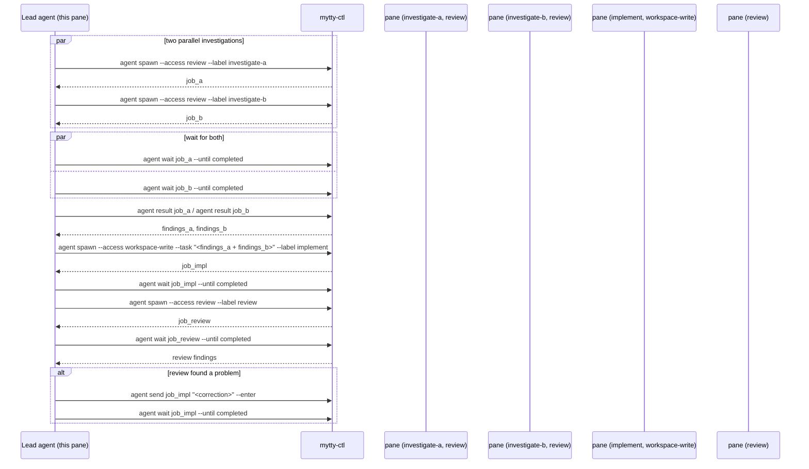
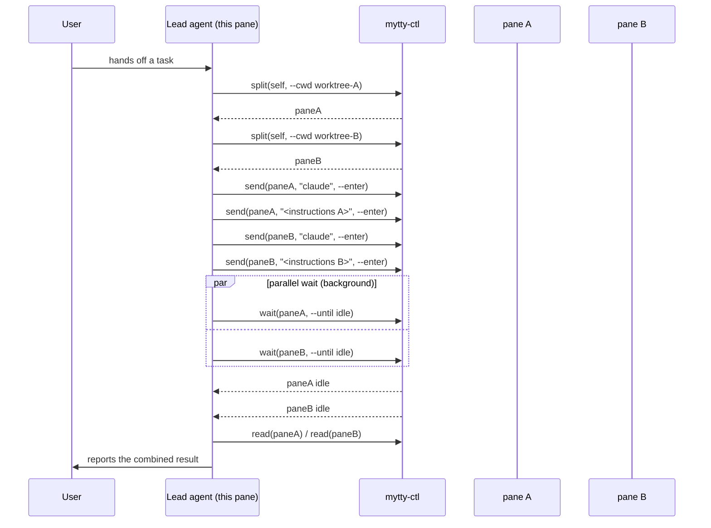
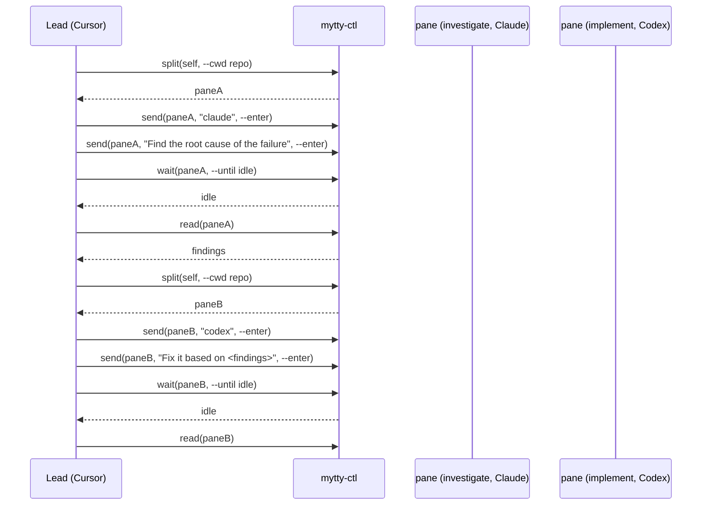
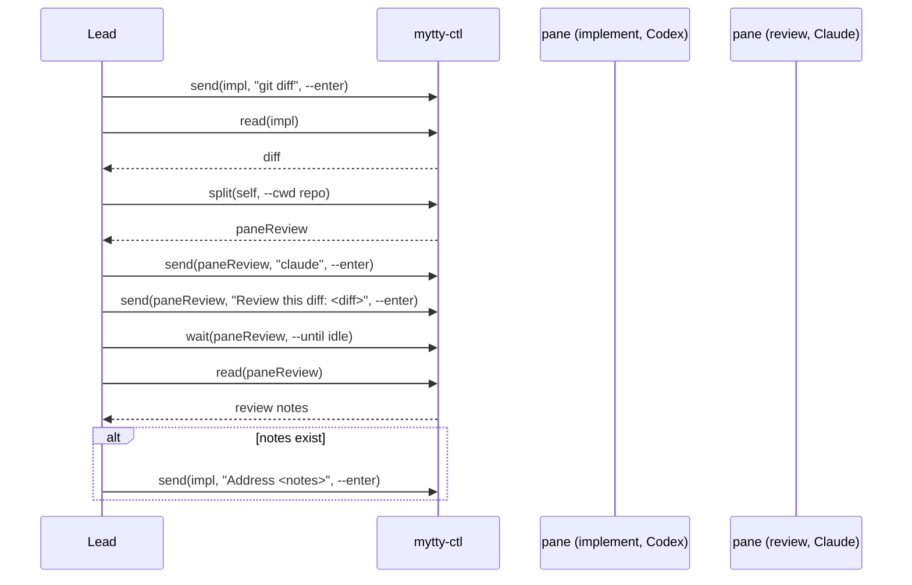
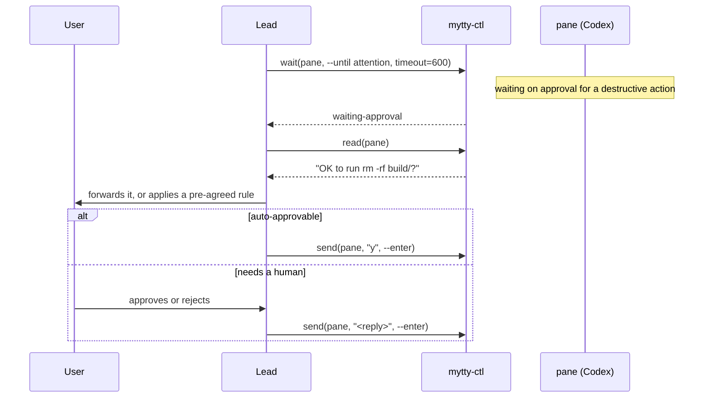

# Orchestrate a team of agents with mytty-ctl

`mytty-ctl` is a local CLI that lets an AI agent running in one pane open,
split, and drive other panes. This is how to use it to run a small team of
subagents that stay visible and interruptible, rather than the kind of
invisible subagent a `Task`/`Agent` tool spawns.

No setup is required inside a Mytty pane: every pane gets
`MYTTY_CONTROL_SOCKET`, `MYTTY_CTL_BIN`, and `MYTTY_SURFACE_ID` in its shell
environment automatically, so an agent can call `"$MYTTY_CTL_BIN" agent
spawn --provider codex --task "..."` without anyone wiring anything up
first. The full command list and JSON output shapes are documented
separately in [mytty-ctl command reference](../reference/mytty-ctl.md);
this page is about the shapes of work that are worth building with it.

## Using this from another project

This file and the command reference live in the mytty repo, but a lead
agent working in some other project's pane won't have either on disk. Tell
it to run `"$MYTTY_CTL_BIN" guide` instead -- it prints the same
environment variables, flow, and provider launch commands as plain text,
straight from the binary that's already running in the pane, so it stays
in sync with whatever Mytty build is installed.

## Preferred: the agent orchestration API

`agent spawn`/`agent wait`/`agent result`/`agent send` cover the flow
below without the two failure modes that show up when the same flow is
built by hand out of `split` + `send` + `wait`: a task sent right after
the launch command landing before the worker's TUI is ready to receive
it, and a `wait` resolving from a run that was already in progress in a
reused pane before this particular spawn. `agent spawn` delivers the
launch command and task as one shell input, and every `agent wait` is
scoped to the exact run its own `agent spawn` started -- see [Agent job
binding](../reference/mytty-ctl.md#agent-job-binding) for how that's
enforced. Reach for the low-level commands ([below](#manual-pane-control-escape-hatch))
only for driving a pane by hand, not for running a team.

Here is the staged shape most orchestration work reduces to: parallel
investigation, then implementation informed by both findings, then
review, with a correction loop if review finds something.



```bash
# 1. Spawn two read-only investigation workers in parallel.
job_a=$("$MYTTY_CTL_BIN" agent spawn --provider codex --access review \
  --task "Investigate why login times out under load." \
  --label investigate-a | jq -r '.job.jobID.rawValue')
job_b=$("$MYTTY_CTL_BIN" agent spawn --provider claude --access review \
  --task "Investigate whether the timeout is client- or server-side." \
  --label investigate-b | jq -r '.job.jobID.rawValue')

# 2. Wait for both -- they ran in parallel, so order doesn't matter.
"$MYTTY_CTL_BIN" agent wait "$job_a" --until completed
"$MYTTY_CTL_BIN" agent wait "$job_b" --until completed

# 3. Collect both results.
findings_a=$("$MYTTY_CTL_BIN" agent result "$job_a" | jq -r '.content.text')
findings_b=$("$MYTTY_CTL_BIN" agent result "$job_b" | jq -r '.content.text')

# 4. Spawn a workspace-write implementation worker with the combined findings.
job_impl=$("$MYTTY_CTL_BIN" agent spawn --provider codex --access workspace-write \
  --task "Findings from investigation-a: $findings_a
Findings from investigation-b: $findings_b
Fix the login timeout described above." --label implement \
  | jq -r '.job.jobID.rawValue')
"$MYTTY_CTL_BIN" agent wait "$job_impl" --until completed

# 5. Spawn a review worker after implementation finishes.
job_review=$("$MYTTY_CTL_BIN" agent spawn --provider claude --access review \
  --task "Review the changes made for the login timeout fix." \
  --label review | jq -r '.job.jobID.rawValue')
"$MYTTY_CTL_BIN" agent wait "$job_review" --until completed

# 6. If review finds problems, send a follow-up correction to the
#    implementation job instead of spawning a new one.
"$MYTTY_CTL_BIN" agent send "$job_impl" "Review found: <issue>. Please fix." --enter
"$MYTTY_CTL_BIN" agent wait "$job_impl" --until completed

# Close every job once its pane is no longer needed.
"$MYTTY_CTL_BIN" agent close "$job_a"
```

This is exactly the recipe `"$MYTTY_CTL_BIN" guide` prints, so a lead
agent that only has the binary on `PATH` (no access to this file) can get
the same steps without reading mytty's docs.

## Manual pane control (escape hatch)

The rest of this page -- `split`, `send`, `wait --until idle`, `read` --
predates the `agent` API and still works. Reach for it when a human is
watching and stepping in, or when the task genuinely doesn't fit "spawn
one worker with one task" (for example, typing a sequence of unrelated
commands into a pane over time). For running a team of workers, prefer
the `agent` commands above; the races described in this section are
exactly what they were built to avoid.

## The shape of a run

There is no standing orchestrator process. The "lead" is whichever agent is
already talking to the user in the current pane. It calls `mytty-ctl` the
same way it would call any other shell tool, splits off worker panes, sends
each one a prompt, and waits on them in parallel. In practice that means
issuing each `wait` as a backgrounded shell call and letting the harness's
own completion notifications tell it when a worker is done.



Here is a two-pane team built with nothing but `split` and `send`, running on
an actual machine:


```bash
self="$MYTTY_SURFACE_ID"
paneA=$(mytty-ctl split "$self" right --cwd /tmp | jq -r .paneID)
mytty-ctl send "$paneA" "echo '[subagent A] investigating issue #42...'" --enter
paneB=$(mytty-ctl split "$paneA" down --cwd /tmp | jq -r .paneID)
mytty-ctl send "$paneB" "echo '[subagent B] writing tests for the fix...'" --enter
```

## Scenario: splitting one task across identical workers

A large task splits cleanly into independent, same-difficulty pieces, and a
single provider is enough for all of them: for example a lead Claude Code
handing pieces to Claude Code workers in separate worktrees.

```bash
paneA=$("$MYTTY_CTL_BIN" split "$MYTTY_SURFACE_ID" right --cwd worktrees/module-a | jq -r .paneID)
paneB=$("$MYTTY_CTL_BIN" split "$MYTTY_SURFACE_ID" right --cwd worktrees/module-b | jq -r .paneID)
"$MYTTY_CTL_BIN" send "$paneA" "claude" --enter
"$MYTTY_CTL_BIN" send "$paneA" "Refactor module A" --enter
"$MYTTY_CTL_BIN" send "$paneB" "claude" --enter
"$MYTTY_CTL_BIN" send "$paneB" "Refactor module B" --enter
# Run `mytty-ctl wait <pane> --until idle` for each pane in parallel
# (backgrounded), and `read` whichever finishes first.
```

## Scenario: a mixed team split by role

Work that runs in phases (investigate, then implement, then verify), where
each phase suits a different provider's strengths more than the others.
Here a Cursor lead hands investigation to Claude and implementation to Codex:



## Scenario: implementation plus an independent review

Codex implements a change, then a separate Claude pane reviews the diff. It
gives a second opinion that offsets a single provider's own blind spots,
rather than the same model reviewing its own work. Any findings loop back to
the
implementation pane with another `send`.



## Scenario: escalating an approval request

`wait --until attention` catches a pane stuck on a destructive-action
approval, so the lead can forward it to the user or auto-approve it when the
action falls inside a pre-agreed boundary. This suits permission checks that
carry real risk, such as delete, push, or an external API call, without
needing a human watching every pane continuously. Antigravity never emits
approval or input events, so this scenario doesn't work for it. Cursor
doesn't emit `input-requested`, but it estimates a stalled shell approval
and reaches `waiting-approval`, so it works here too.



## Things that trip this up in practice

- If the target provider's hook integration isn't enabled yet in Settings,
  `agent spawn` fails immediately with `provider-integration-not-installed`
  (or `provider-integration-needs-repair`) instead of creating a pane.
  Enable that provider under Settings > Agents before using it from a
  script for the first time. See [Agent providers](../reference/agent-providers.md)
  for which configuration file gets written.
- `agent spawn` never reuses an existing pane, so `agent wait` can never
  resolve from a run that predates the job it's waiting on -- that race is
  exactly what the job/run binding described in
  [Agent job binding](../reference/mytty-ctl.md#agent-job-binding) exists
  to prevent. It does mean each spawn is a new pane, so close jobs you no
  longer need with `agent close`.
- `agent` job IDs are not persisted; a Mytty restart makes previously
  issued job IDs return `job-not-found`. The panes/processes they pointed
  at keep running, they're just no longer reachable by that job ID.
- `new-tab`/`split` cannot target a specific window. They land on the
  active window, or the first one Mytty finds if none is active. To put a
  pane in a particular window, `split` an existing pane in that window
  instead. `agent spawn`'s `--anchor` has the same constraint, since it
  splits off the anchor pane the same way.
- Antigravity's hooks never emit approval or input events, so
  `wait --until attention`/`agent wait --until attention` against that
  provider only returns on timeout; use `--until idle`/`--until completed`
  for it instead. Cursor doesn't emit `input-requested`, but it estimates a
  stalled shell approval from `preToolUse`, reaching `waiting-approval`
  roughly 10 seconds after the command starts.
- Sending a follow-up to a completed job with `agent send` unbinds and
  rebinds the job to track the next run, so the `agent wait --until
  completed` that follows waits for the run the follow-up started, not the
  previous one. If the worker never picks up the follow-up, that rebind
  hits the same 30-second launch deadline and ends in `launch-failed`.
