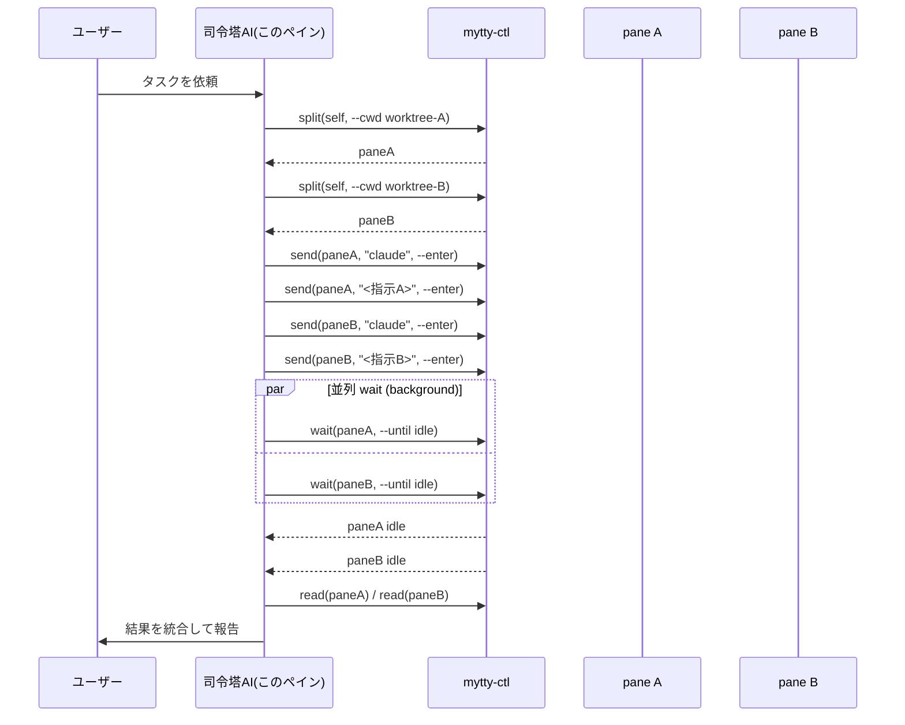
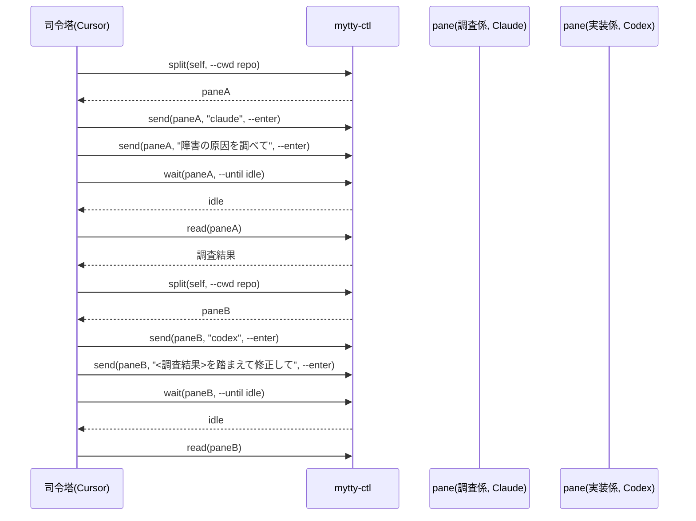
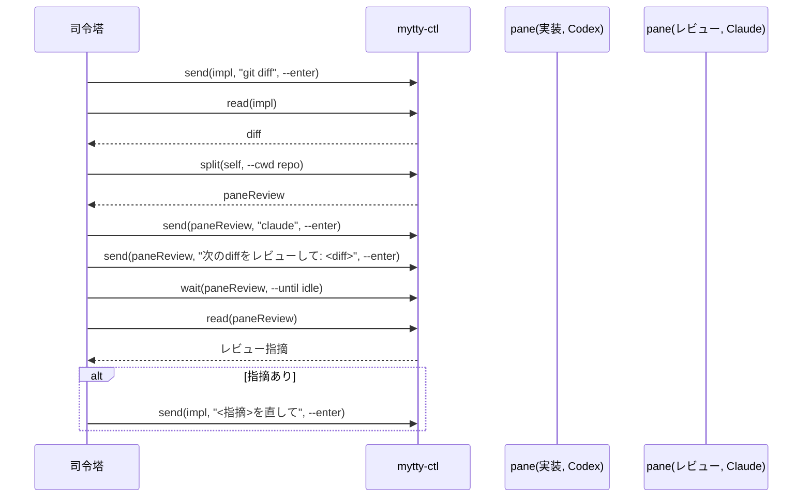
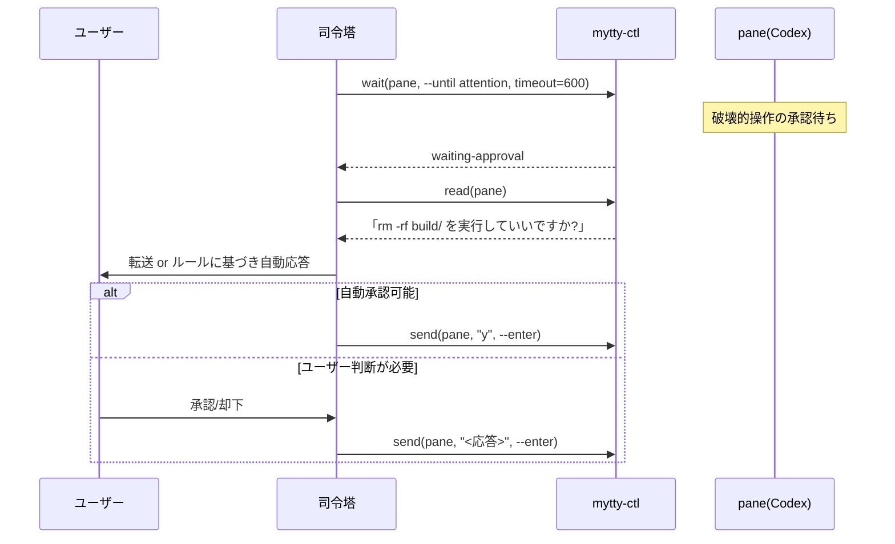

# mytty-ctl でエージェントのチームを動かす

`mytty-ctl` は、あるペインで動いている AI エージェントが他のペインを開いて
操作するためのローカル CLI。`Task`/`Agent` ツールが作るような見えない
サブエージェントではなく、画面に見えて割り込めるペインでサブエージェントの
小さなチームを動かす手順を示す。

Mytty のペイン内であれば準備は要らない。すべてのペインのシェル環境には
`MYTTY_CONTROL_SOCKET`、`MYTTY_CTL_BIN`、`MYTTY_SURFACE_ID` が自動で入って
いるため、エージェントは誰かが事前に配線しなくても
`"$MYTTY_CTL_BIN" split "$MYTTY_SURFACE_ID" right` のように呼べる。全コマンド
の一覧と JSON 出力の形式は
[mytty-ctl コマンドリファレンス](../reference/mytty-ctl.md) にまとめてある
ので、このページでは組み立てる価値のある使い方の形に絞る。

## 実行の基本形

常駐する orchestrator process は存在しない。「司令塔」は、今まさにユーザー
と話しているそのペインのエージェント自身である。司令塔は他のシェルツール
を呼ぶのと同じ感覚で `mytty-ctl` を呼び、作業用のペインを分割し、それぞれに
prompt を送り、並行して完了を待つ。実際には各 `wait` をバックグラウンドの
シェル呼び出しとして投げ、どのワーカーが終わったかはハーネス側の完了通知に
任せる形になる。



`split` と `send` だけで作った 2 ペインのチームを実機で撮影したもの。


```bash
self="$MYTTY_SURFACE_ID"
paneA=$(mytty-ctl split "$self" right --cwd /tmp | jq -r .paneID)
mytty-ctl send "$paneA" "echo '[subagent A] investigating issue #42...'" --enter
paneB=$(mytty-ctl split "$paneA" down --cwd /tmp | jq -r .paneID)
mytty-ctl send "$paneB" "echo '[subagent B] writing tests for the fix...'" --enter
```

## シナリオ: 1 つのタスクを同質なワーカーに分ける

大きめのタスクが独立した同程度の難易度の単位に素直に分割でき、どの単位も
同じ provider で問題ない場合に向く。たとえば司令塔の Claude Code が、別々
の worktree で動く Claude Code のワーカーに単位を割り振る形。

```bash
paneA=$("$MYTTY_CTL_BIN" split "$MYTTY_SURFACE_ID" right --cwd worktrees/module-a | jq -r .paneID)
paneB=$("$MYTTY_CTL_BIN" split "$MYTTY_SURFACE_ID" right --cwd worktrees/module-b | jq -r .paneID)
"$MYTTY_CTL_BIN" send "$paneA" "claude" --enter
"$MYTTY_CTL_BIN" send "$paneA" "モジュールAをリファクタリングして" --enter
"$MYTTY_CTL_BIN" send "$paneB" "claude" --enter
"$MYTTY_CTL_BIN" send "$paneB" "モジュールBをリファクタリングして" --enter
# 各 pane に対して `mytty-ctl wait <pane> --until idle` を並列(バックグラウンド)で
# 実行し、先に終わったものから `read` で結果を回収する。
```

## シナリオ: 役割で分けた混成チーム

調査、実装、検証のように工程が直列に進み、工程ごとに向いている provider が
違う場合。ここでは司令塔の Cursor が調査を Claude に、実装を Codex に渡す。



## シナリオ: 実装と独立レビューのペア

Codex が実装した後、別の Claude ペインに diff をレビューさせる。同じ
モデルが自分の実装を見返すのではなく、別の視点でセカンドオピニオンを得る
形になる。指摘が出れば `send` で実装ペインに差し戻す。



## シナリオ: 承認待ちのエスカレーション

`wait --until attention` で破壊的操作の承認待ちを検知し、ユーザーに転送
するか、あらかじめ合意した範囲内であれば司令塔が代わりに承認する。削除や
push、外部 API 呼び出しのように実害のある権限確認に向いていて、かといって
すべてのペインに人間が常時張り付く必要もなくなる。Cursor と Antigravity は
承認・入力の event を出さないため、`waiting-approval` を報告する provider
でのみこのシナリオが成立する。



## 実際にハマった点

- `new-tab` はどのウィンドウに作るかを指定できず、アクティブウィンドウ
  (無ければ最初に見つかったウィンドウ)に作られる。特定のウィンドウを狙う
  なら、そのウィンドウの既存ペインを `split` する方を使う。
- 対象 provider の hook 連携が Settings でまだ有効化されていないと、
  エージェントの event が一切飛んでこず、`wait` はエラーにはならずタイム
  アウトするまでブロックし続ける。新しい provider を初めてチームに使う
  ときに踏みやすいので、先に
  [エージェント連携を導入して確認する](install-agent-integrations_ja.md)
  を済ませておくとよい。
- Cursor と Antigravity の hook は承認・入力の event を出さないため、
  この 2 provider に対して `wait --until attention` を使うとタイムアウト
  でしか返らない。これらには `--until idle` を使う。
