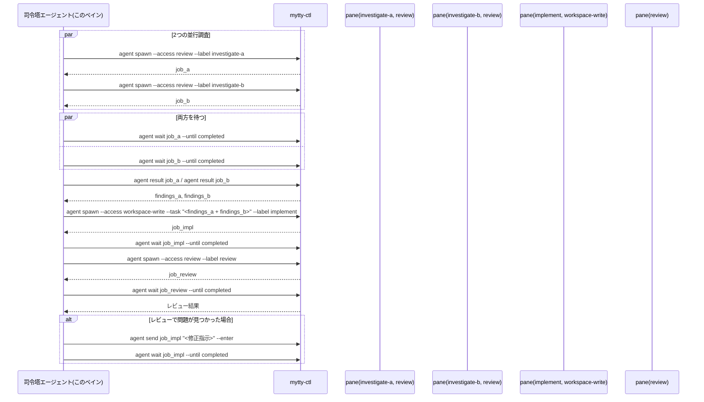
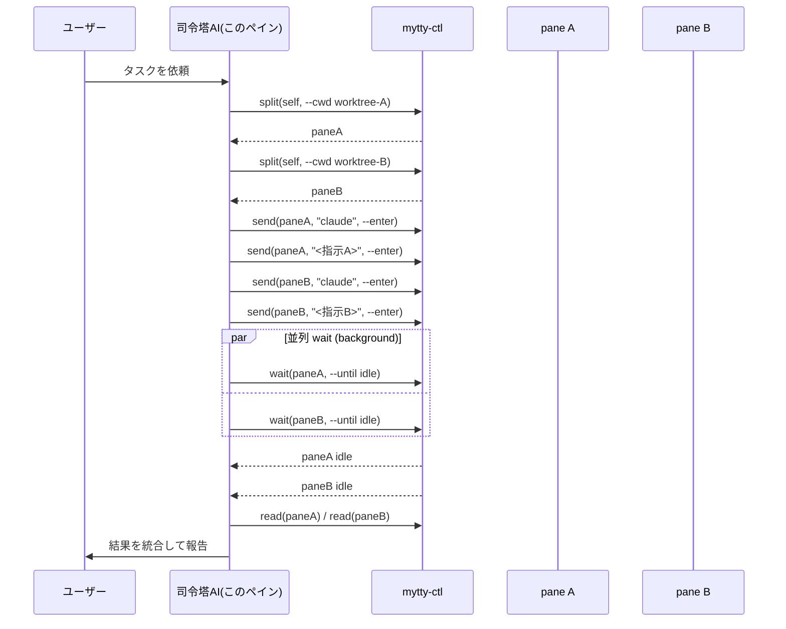
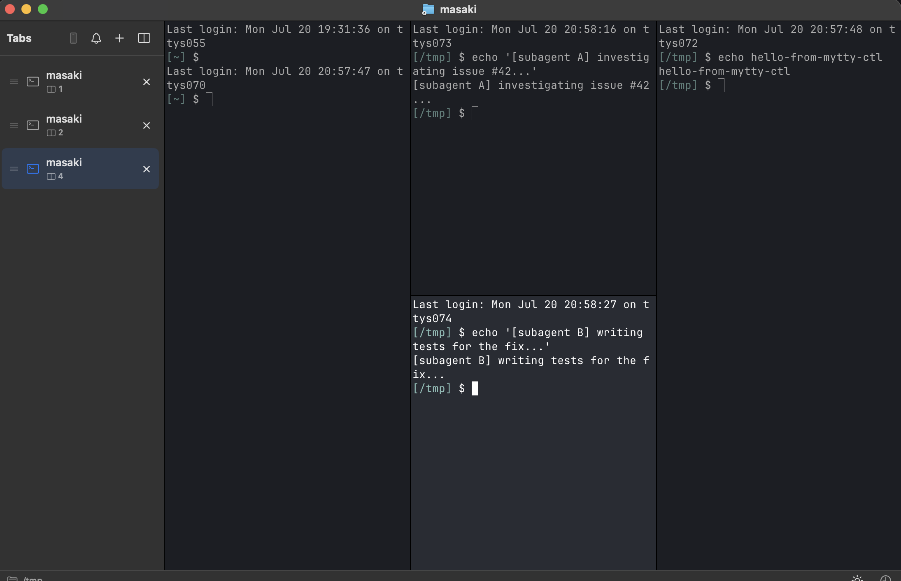
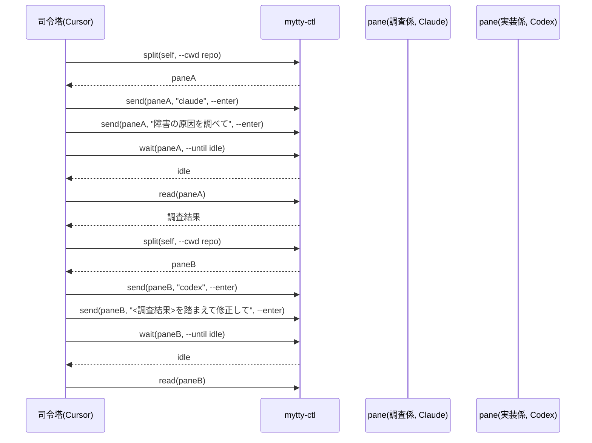
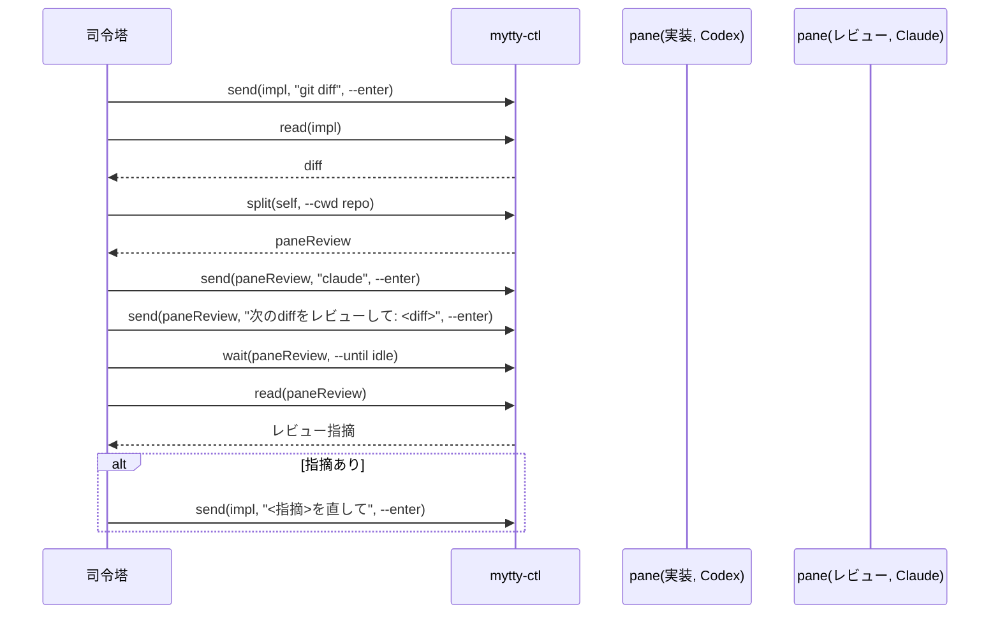
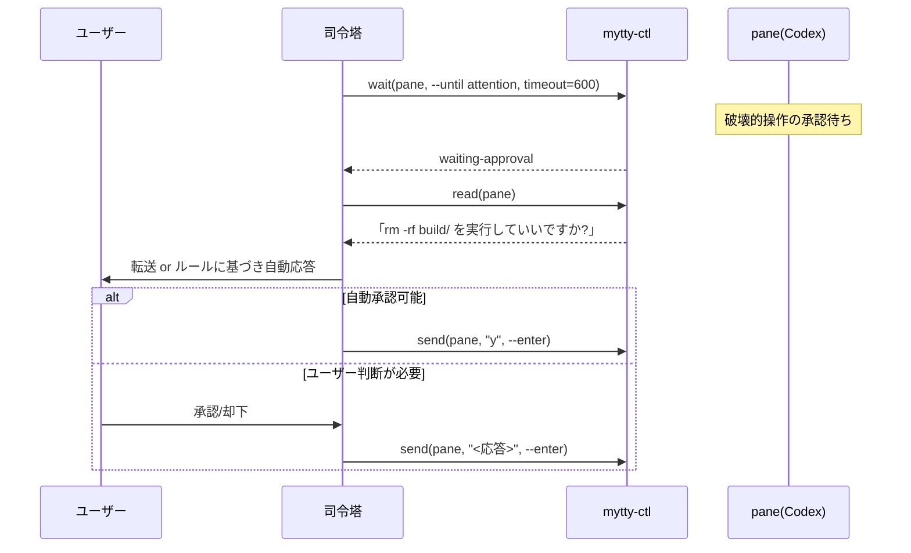

# mytty-ctl でエージェントのチームを動かす

`mytty-ctl` は、あるペインで動いている AI エージェントが他のペインを開いて
操作するためのローカル CLI。`Task`/`Agent` ツールが作るような見えない
サブエージェントではなく、画面に見えて割り込めるペインでサブエージェントの
小さなチームを動かす手順を示す。

Mytty のペイン内であれば準備は要らない。すべてのペインのシェル環境には
`MYTTY_CONTROL_SOCKET`、`MYTTY_CTL_BIN`、`MYTTY_SURFACE_ID` が自動で入って
いるため、エージェントは誰かが事前に配線しなくても
`"$MYTTY_CTL_BIN" agent spawn --provider codex --task "..."` のように呼べる。
全コマンドの一覧と JSON 出力の形式は
[mytty-ctl リファレンス](../reference/mytty-ctl_ja.md) にまとめてある
ので、このページでは組み立てる価値のある使い方の形に絞る。

## 設定画面から準備する

この機能に関わる設定は 設定 > Orchestration に集めてある。ペインの中から
使うだけなら何もしなくてよく、この画面が要るのは次の2つを整えたいとき。

**CLI を Mytty の外から呼べるようにする**
「CLI をインストール」で `~/.local/bin` にシンボリックリンクを作る。Mytty が
開いたペインでは最初から `mytty-ctl` が使えるので、必要になるのは別の
ターミナルアプリやスクリプトから呼ぶ場合だけ。管理者権限は要求しない。

**エージェントに使い方を教える**
「Agent に Mytty オーケストレーションの使い方を教える」をオンにすると、対応するエージェントは複数
ペインでの作業を頼まれたときに自分から `mytty-ctl guide` を読むようになる。
書き込み先は Claude Code が `~/.claude/skills/mytty-panes/SKILL.md`、Codex が
`~/.codex/AGENTS.md`。それぞれの現在の状態が画面に出る。「Show what will be
written」を開くと実際に書き込まれる文面をそのまま確認できる。開くだけでは
書き込まれない。文面自体は 設定 > General の言語設定に従って英語・日本語が
切り替わり、切り替えた次のタイミングで既存のファイルも書き直される。

同じ画面の下部に、呼び出し方の例が条件別に並ぶ。案内をオンにしている場合と
していない場合で書き方が変わるので、自分の設定に合うものをコピーして使う。

## 他プロジェクトから使うとき

このページと mytty-ctl リファレンスは mytty リポジトリの中にあるため、
別プロジェクトのペインで動いている司令塔エージェントはどちらも手元に
持っていない。代わりに `"$MYTTY_CTL_BIN" guide` を実行させること。同じ
環境変数、流れ、provider ごとの起動コマンドをプレーンテキストで出す。
ペインで実際に動いているバイナリから直接読むので、インストールされた
Mytty のバージョンとも常に一致する。

## 推奨: agent オーケストレーション API

`agent spawn`/`agent wait`/`agent result`/`agent send` は、下の流れを
`split` + `send` + `wait` で手組みしたときに起きがちな2つの失敗を
避けられる。1つは、起動コマンドの直後に送ったタスクが worker の TUI
起動と競合して届かないケース。もう1つは、`wait` が使い回されたペインの
前からの実行状態で解決してしまうケース。`agent spawn` は起動コマンドと
タスクを1回のシェル入力として渡し、`agent wait` はそれぞれの
`agent spawn` が実際に始めた実行だけを対象にする。仕組みの詳細は
[mytty-ctl リファレンス](../reference/mytty-ctl_ja.md)の
「job のバインディング」を参照。ペインを手動で操作したいときだけ、下の
「手動でのペイン操作(エスケープハッチ)」の低レベルコマンドを使う。
チーム運用には使わないこと。

オーケストレーション作業の多くはこの段階構成に落ち着く。2つの並行調査、
その両方の結果を踏まえた実装、そしてレビュー。レビューで問題が見つかれば
差し戻す。



```bash
# 1. 読み取り専用の調査 worker を2つ並行して起動する。
job_a=$("$MYTTY_CTL_BIN" agent spawn --provider codex --access review \
  --task "ログイン処理が高負荷時にタイムアウトする原因を調査して。" \
  --label investigate-a | jq -r '.job.jobID.rawValue')
job_b=$("$MYTTY_CTL_BIN" agent spawn --provider claude --access review \
  --task "タイムアウトがクライアント側かサーバー側か調べて。" \
  --label investigate-b | jq -r '.job.jobID.rawValue')

# 2. 両方を待つ。並行実行なので順番は問わない。
"$MYTTY_CTL_BIN" agent wait "$job_a" --until completed
"$MYTTY_CTL_BIN" agent wait "$job_b" --until completed

# 3. 両方の結果を回収する。
findings_a=$("$MYTTY_CTL_BIN" agent result "$job_a" | jq -r '.content.text')
findings_b=$("$MYTTY_CTL_BIN" agent result "$job_b" | jq -r '.content.text')

# 4. 調査結果を合わせたタスクで workspace-write の実装 worker を起動する。
job_impl=$("$MYTTY_CTL_BIN" agent spawn --provider codex --access workspace-write \
  --task "調査結果A: $findings_a
調査結果B: $findings_b
上記のログインタイムアウトを修正して。" --label implement \
  | jq -r '.job.jobID.rawValue')
"$MYTTY_CTL_BIN" agent wait "$job_impl" --until completed

# 5. 実装が終わったらレビュー worker を起動する。
job_review=$("$MYTTY_CTL_BIN" agent spawn --provider claude --access review \
  --task "ログインタイムアウト修正の変更をレビューして。" \
  --label review | jq -r '.job.jobID.rawValue')
"$MYTTY_CTL_BIN" agent wait "$job_review" --until completed

# 6. レビューで問題が見つかったら、新しい job を立てずに実装 job へ
#    修正指示を差し戻す。
"$MYTTY_CTL_BIN" agent send "$job_impl" "レビュー指摘: <内容>。修正して。" --enter
"$MYTTY_CTL_BIN" agent wait "$job_impl" --until completed

# 不要になった job のペインは閉じる。
"$MYTTY_CTL_BIN" agent close "$job_a"
```

これは `"$MYTTY_CTL_BIN" guide` が出力するのと同じレシピなので、この
ファイルにアクセスできず `PATH` 上のバイナリしか持たない司令塔エージェント
でも、mytty のドキュメントを読まずに同じ手順を踏める。

## 手動でのペイン操作(エスケープハッチ)

このページの残りにある `split`、`send`、`wait --until idle`、`read` は
agent API より前からあるコマンドで、今も動く。人間が見ながら介入する
場合や、「1つの worker に1つのタスクを渡す」という形にそもそも当てはまら
ない作業(たとえば時間をおいて無関係なコマンドを1つのペインに次々送る、
など)にはこちらを使う。ワーカーのチームを動かす用途では上の `agent`
コマンドを優先する。ここで説明する競合は、まさに `agent` コマンドが
避けるために作られたものになる。

## 実行の基本形

常駐する orchestrator process は存在しない。「司令塔」は、今まさにユーザー
と話しているそのペインのエージェント自身である。司令塔は他のシェルツール
を呼ぶのと同じ感覚で `mytty-ctl` を呼び、作業用のペインを分割し、それぞれに
prompt を送り、並行して完了を待つ。実際には各 `wait` をバックグラウンドの
シェル呼び出しとして投げ、どのワーカーが終わったかはハーネス側の完了通知に
任せる形になる。



`split` と `send` だけで作った 2 ペインのチームを実機で撮影したもの。



```bash
self="$MYTTY_SURFACE_ID"
paneA=$(mytty-ctl split "$self" right --cwd /tmp | jq -r .paneID)
mytty-ctl send "$paneA" "echo '[subagent A] investigating issue #42...'" --enter
paneB=$(mytty-ctl split "$paneA" down --cwd /tmp | jq -r .paneID)
mytty-ctl send "$paneB" "echo '[subagent B] writing tests for the fix...'" --enter
```

## シナリオ: 1 つのタスクを同質なワーカーに分ける

大きめのタスクが独立した同程度の難易度の単位に素直に分割でき、どの単位も
同じ provider で問題ない場合に向く。たとえば司令塔の Claude Code が、別々
の worktree で動く Claude Code のワーカーに単位を割り振る形。

```bash
paneA=$("$MYTTY_CTL_BIN" split "$MYTTY_SURFACE_ID" right --cwd worktrees/module-a | jq -r .paneID)
paneB=$("$MYTTY_CTL_BIN" split "$MYTTY_SURFACE_ID" right --cwd worktrees/module-b | jq -r .paneID)
"$MYTTY_CTL_BIN" send "$paneA" "claude" --enter
"$MYTTY_CTL_BIN" send "$paneA" "モジュールAをリファクタリングして" --enter
"$MYTTY_CTL_BIN" send "$paneB" "claude" --enter
"$MYTTY_CTL_BIN" send "$paneB" "モジュールBをリファクタリングして" --enter
# 各 pane に対して `mytty-ctl wait <pane> --until idle` を並列(バックグラウンド)で
# 実行し、先に終わったものから `read` で結果を回収する。
```

## シナリオ: 役割で分けた混成チーム

調査、実装、検証のように工程が直列に進み、工程ごとに向いている provider が
違う場合。ここでは司令塔の Cursor が調査を Claude に、実装を Codex に渡す。



## シナリオ: 実装と独立レビューのペア

Codex が実装した後、別の Claude ペインに diff をレビューさせる。同じ
モデルが自分の実装を見返すのではなく、別の視点でセカンドオピニオンを得る
形になる。指摘が出れば `send` で実装ペインに差し戻す。



## シナリオ: 承認待ちのエスカレーション

`wait --until attention` で破壊的操作の承認待ちを検知し、ユーザーに転送
するか、あらかじめ合意した範囲内であれば司令塔が代わりに承認する。削除や
push、外部 API 呼び出しのように実害のある権限確認に向いていて、かといって
すべてのペインに人間が常時張り付く必要もなくなる。Antigravity は承認・入力の
event を出さないため、このシナリオは成立しない。Cursor は input-requested を
出さないが、シェル承認の停滞を推定して `waiting-approval` になるので使える。



## 実際にハマった点

- 対象 provider の hook 連携が Settings でまだ有効化されていないと、
  `agent spawn` はペインを作らずにその場で
  `provider-integration-not-installed`(または
  `provider-integration-needs-repair`)で失敗する。新しい provider を
  スクリプトから初めて使う前に、設定 > Agents でその provider を有効化して
  おくこと。どの設定ファイルに何が書き込まれるかは
  [エージェント provider](../reference/agent-providers_ja.md) を参照。
- `agent spawn` は既存ペインを使い回さないので、`agent wait` がその job
  より前からの実行状態で解決してしまうことはない。この job/実行の
  バインディング([mytty-ctl リファレンス](../reference/mytty-ctl_ja.md)の
  「job のバインディング」参照)がまさにその競合を防ぐための仕組み。
  裏を返すと spawn のたびに新しいペインが増えるので、不要になった job は
  `agent close` で閉じること。
- `agent` の job ID は永続化されない。Mytty を再起動すると、それより前に
  発行した job ID は `job-not-found` になる。job が指していたペインや
  プロセス自体は動き続けるが、その job ID からはもう辿れない。
- `new-tab`/`split` はどのウィンドウに作るかを指定できず、アクティブ
  ウィンドウ(無ければ最初に見つかったウィンドウ)に作られる。特定の
  ウィンドウを狙うなら、そのウィンドウの既存ペインを `split` する方を
  使う。`agent spawn` の `--anchor` も同じ制約を受ける。アンカーペインを
  同じように分割するだけなので。
- Antigravity の hook は承認・入力の event を出さないため、
  `wait --until attention`/`agent wait --until attention` はタイムアウトで
  しか返らない。この provider には `--until idle`/`--until completed` を
  使う。Cursor は input-requested を出さないが、シェル承認については
  `preToolUse` からの遅延で停滞を推定するため、コマンド開始からおよそ
  10 秒で `waiting-approval` に到達する。
- 完了済みの job に `agent send` で追い指示を送ると、その job は次の実行を
  追えるように bind を解除して張り直す。そのため直後の
  `agent wait --until completed` は前の実行では解決せず、追い指示が生んだ
  実行の完了を待つ。裏を返すと、worker が追い指示を拾わなかった場合は
  30 秒の起動デッドラインに引っかかり `launch-failed` になる。
