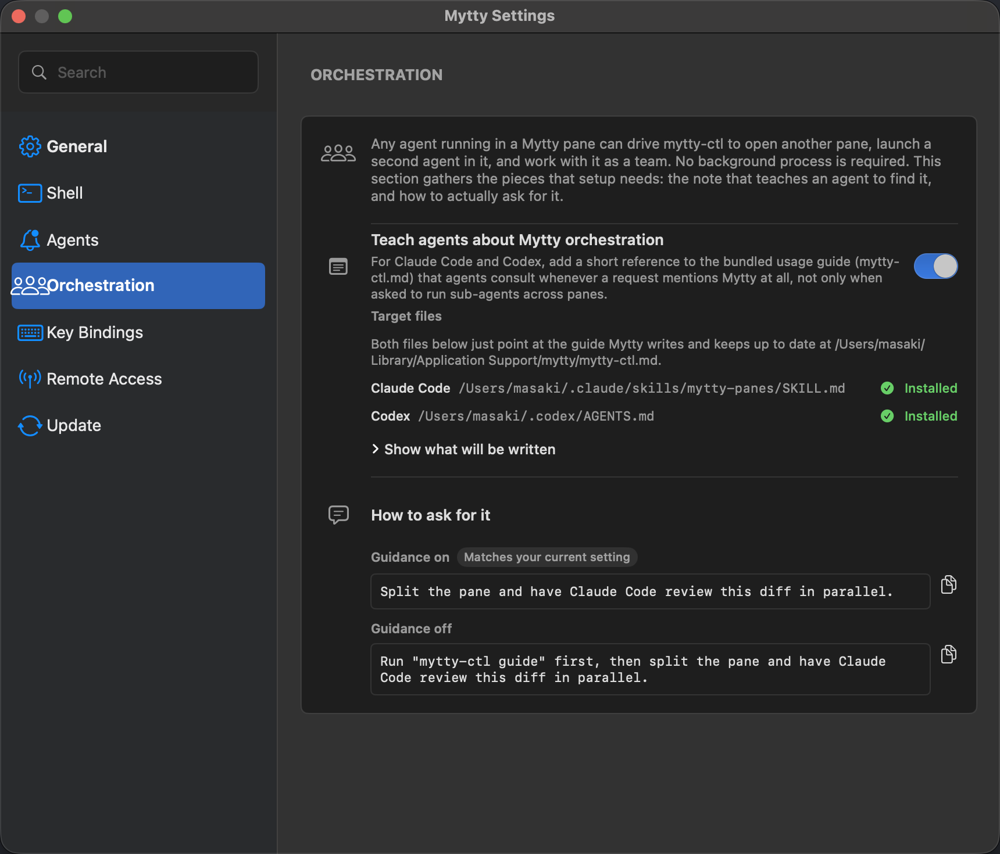

# mytty-ctl でエージェントのチームを動かす

同梱されている CLI `mytty-ctl` を使うと、AI エージェントが他のペインを開いて操作できます。`Task`/`Agent` ツールが作るような見えないサブエージェントではなく、画面に見えて割り込めるペインでサブエージェントの小さなチームを動かすイメージです。

Mytty ではすべてのペインのシェル環境に `MYTTY_CONTROL_SOCKET`、`MYTTY_CTL_BIN`、`MYTTY_SURFACE_ID` が自動で入るため、エージェントは他に準備することなく `"$MYTTY_CTL_BIN" agent spawn --provider codex --task "..."` のように他の AI エージェントを呼び出せます。

mytty-ctl で使える全コマンドの一覧と JSON 出力の形式は [mytty-ctl リファレンス](../reference/mytty-ctl_ja.md) にまとめてあります。

## 使い方

Agent にガイドを読ませる方法は2つあります。

### 依頼文に Mytty と書くだけ

「Agent に Mytty オーケストレーションの使い方を教える」(設定 > オーケストレーション)がオンなら、依頼のどこかに Mytty と書くだけで十分です。この設定が書き込む参照(Claude Code なら `~/.claude/skills/mytty-panes/SKILL.md`、Codex なら `~/.codex/AGENTS.md` 内のブロック)がそれだけで発火し、agent を `mytty-ctl guide` へ導きます。

> Mytty を使って、ペインを分割してこの diff を Claude Code に並行でレビューさせて。

### Mytty と書くことすら省く: あらかじめ CLAUDE.md や AGENTS.md に使い方を書いておく

このリポジトリ自身の CLAUDE.md や AGENTS.md に使い方を書いておけば、依頼文に「Mytty」と書く必要すらなくなります。下記のプロンプトだけで実行できます。

> ペインを分割して、この diff を Claude Code に並行でレビューさせて。

## 段階的な例: 2つの worker を動かして結果を集める

読み取り専用の調査 worker を2つ並行で起動し、両方を待って結果を集める例です。`agent` コマンドを直接使います。

```bash
job_a=$(mytty-ctl agent spawn --provider claude --worktree investigate-a \
  --task "ログイン処理が高負荷時にタイムアウトする原因を調査して。" \
  --label investigate-a | jq -r '.job.jobID.rawValue')
job_b=$(mytty-ctl agent spawn --provider claude --worktree investigate-b \
  --task "タイムアウトがクライアント側とサーバー側のどちらで起きているか調査して。" \
  --label investigate-b | jq -r '.job.jobID.rawValue')
```

どちらの worker も `claude` で、これを呼び出している lead と同じ provider です。そのため `--access` を省略すると、固定のフラグ集合ではなく lead 自身の permission モードを引き継ぎます。worker が自分と同じ provider のときは、これが基本の使い方です。ここで `--access workspace-write` を明示的に指定するのは適切ではありません。`claude` の worker は lead 自身のモードに関わらず常に `--permission-mode acceptEdits` で起動するため、lead がより広い権限で動いていても、worker は承認プロンプトのたびに止まって待つようになってしまいます。`--worktree` により、それぞれの worker は自分専用の git worktree を持つので、2つが同じファイルを取り合うことがありません。

```bash
mytty-ctl agent wait "$job_a" --until completed
mytty-ctl agent wait "$job_b" --until completed
findings_a=$(mytty-ctl agent result "$job_a" | jq -r '.content.text')
findings_b=$(mytty-ctl agent result "$job_b" | jq -r '.content.text')
```

worker が2つ程度なら、逐次の `wait` 2回で十分です。もっと多くの worker を同時に見張る場合は、ペインごとに `wait`/`agent wait` をブロックさせるのではなく、`events` をループでポーリングしてください。1回の long-poll 呼び出しで、どのペインでもよいので次に状態が変わった worker を拾えます。

```bash
cursor=$(mytty-ctl events | jq -r '.latestSequence')
while true; do
  response=$(mytty-ctl events --after "$cursor" --timeout 60)
  cursor=$(echo "$response" | jq -r '.latestSequence')
  echo "$response" | jq -c '.records[]'   # どの job が変化したか paneID/kind から判断
done
```

コマンドの全一覧・JSON の形・失敗コードは [mytty-ctl リファレンス](../reference/mytty-ctl_ja.md) を参照してください。このページはあくまで手早い案内であり、リファレンスの代わりではありません。

worker が承認プロンプトで止まってしまった場合(`--access workspace-write` で起動した worker によくあります。`claude` はファイル編集を許可していても Bash コマンドの承認は別に必要です)は、経過時間で見当をつけるのではなく `--until attention` で捕捉し、そのままプロンプトに答えます。

```bash
mytty-ctl agent wait "$job_impl" --until attention
result=$(mytty-ctl agent result "$job_impl")
pane_impl=$(echo "$result" | jq -r '.job.paneID.rawValue')
# $result の .content.text でどのプロンプトが出ているか確認してから答える
mytty-ctl send-key "$pane_impl" "1"
mytty-ctl agent wait "$job_impl" --until completed
```

`agent send` でテキストを送っても `claude` の承認ダイアログは反応しません。`send-key` で実際のキー入力を送る必要があります。この手順には worker の provider の hook 連携が必要です。詳しくは後述の「hook は必須ではない」を参照してください。

## hook は必須ではない

worker の実行状態(running、idle、succeeded、failed、disconnected)は、設定で hook 連携を一度もインストールしていない provider でも観測できます。Mytty がペインのフォアグラウンドプロセスから実行状態をネイティブに推定するためです。provider の hook をインストールすると、この状態の精度が上がります(推定ではなく実際のライフサイクルイベントになります)。また `wait --until attention`/`agent wait --until attention` には hook が必須です。ネイティブ推定は承認・入力の要求をあえて一切報告しないため、hook 未導入の provider に対する attention wait はブロックせず即座に失敗します。

## ペイン内で TUI アプリをテストする

worker は自分のツール越しに、パイプで繋がれた標準入出力でシェルコマンドを実行しており、自分のペインの pty は自分の TUI がふさいでいます。そのため開発中の TUI アプリ(raw mode で端末を扱うもの)を同じセッションの中から直接動かしたり操作したりすることはできません。代わりに別のペインを開いて実行させると、そのアプリに本物の pty を渡せます。

```bash
pane=$(mytty-ctl split "$MYTTY_SURFACE_ID" right --command '<テスト対象のアプリ>' | jq -r '.paneID')
mytty-ctl send "$pane" "<入力>" --enter   # キー入力そのものを送る場合は send-key
mytty-ctl read "$pane"                    # 描画された画面を確認
mytty-ctl close-pane "$pane"              # 終わったら閉じる
```

手早く動作確認するだけなら `script -q /dev/null <アプリ>` でも疑似端末を割り当てられます。これはテスト対象のプログラムを実行しているだけでサブエージェントを作っているわけではないので、worker contract が禁止している hidden/native なサブエージェントの作成には当たりません。

## 設定画面

この機能に関わる設定は 設定 > オーケストレーション に集約されています。



**エージェントに使い方を教える** 「Agent に Mytty オーケストレーションの使い方を教える」をオンにすると、`~/.claude/skills/mytty-panes/SKILL.md` と `~/.codex/AGENTS.md` に短い参照を書き込みます。実際の使い方の本文は、Mytty が起動のたびに書き出す `~/Library/Application Support/mytty/mytty-ctl.md`(`mytty-ctl guide` の出力と同じ内容)にまとまっており、両方の参照先はそのファイルの絶対パスを指すだけです。そのため Mytty がアップデートされて使い方が変わっても、書き直すのは同梱のガイドだけで、参照側は手直し不要です。

「書き込む内容を表示」を開くと、実際に書き込まれる短い参照文をそのまま確認できます。これを開くだけでは書き込まれません。

同じ画面の下部に、呼び出し方の例が並んでいるので参考にしてください。
