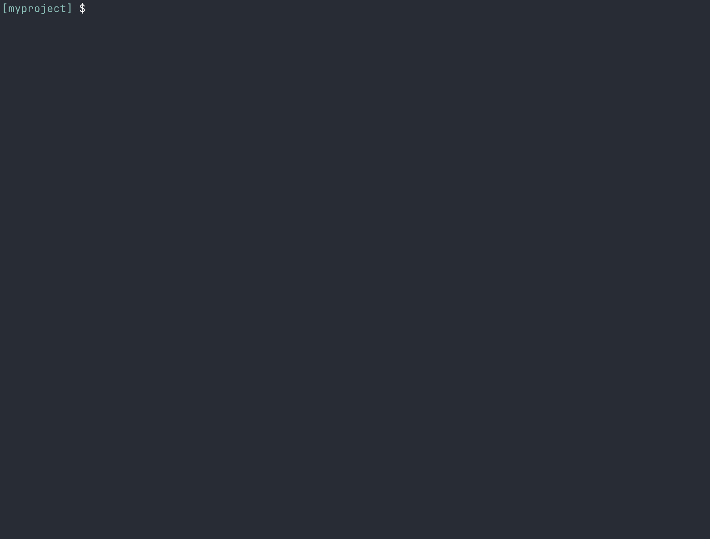
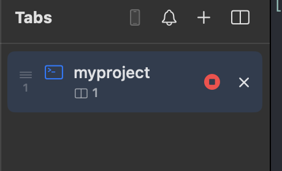

# Record a pane as a GIF

You can capture what's happening in a pane (a build, a demo, an agent at work) as a GIF animation.

## Start and stop a recording

Focus the pane you want to record and run **Start/Stop Recording**. A stop button appears on the tab while it's recording.

Recording stops when you stop it yourself, or automatically after 60 seconds. A save panel opens afterward for you to choose where to write the GIF file.

## Show pressed keys in the recording

Turn on **Show pressed keys in pane** in Settings to display the name of each key below the cursor as you type. This works outside of recording too, but it's especially handy for recordings and demos.
