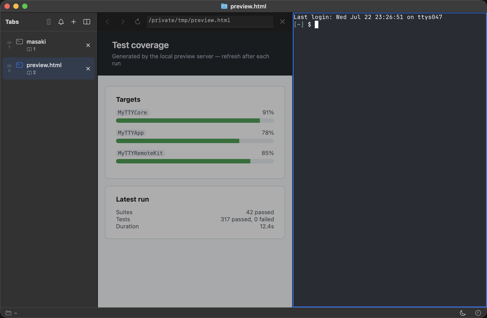

# アプリ内ブラウザを使う

Mytty はペインの中でブラウザペインを開けます。ローカルのドキュメントやプレビューサーバーを見るのに便利です。

## ローカルファイルを開く

「HTML ファイルを開く」を選ぶと、アクティブなペインに HTML を表示できます。

## ターミナルに表示されているリンクをブラウザで開く

ターミナル内で cmd キーを押すと、ブラウザで開けるリンクに下線が表示されます。それをクリックすることで、外部ブラウザで開いたり、別のペインで開くなどのメニューが出てきます。
