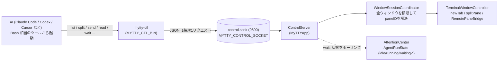
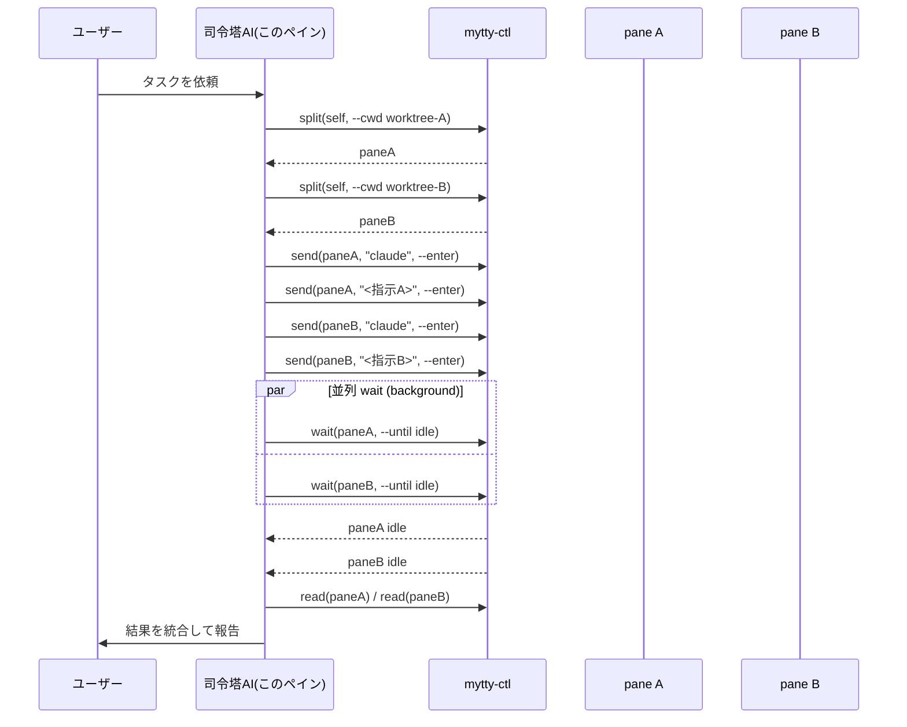
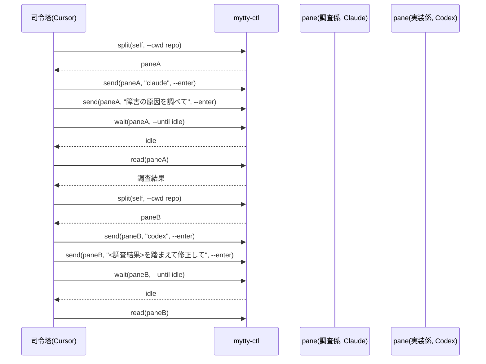
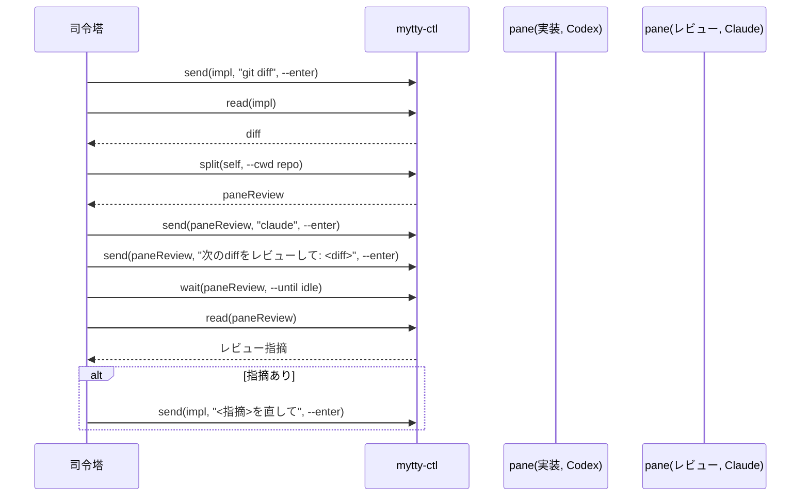
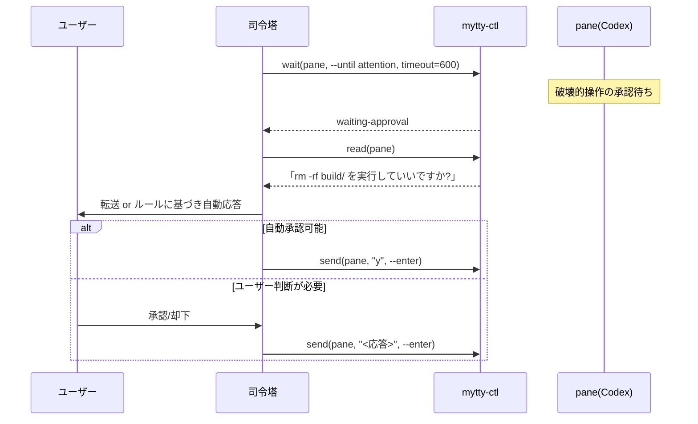

# mytty-ctl: AI からの Mytty 操作

`mytty-ctl` は、AI エージェント(Claude Code, Codex, Cursor など)が Mytty
自身を操作するためのローカル CLI。ペインの作成・分割・入力送信・画面読み取り・
エージェント状態の待機ができる。目的は「複数ペインでサブエージェントのチームを
動かす」ようなスキルを、AI がシェルコマンドだけで組み立てられるようにすること。

`Task`/`Agent` のような不可視のサブエージェントと違い、チームメンバーは
**実際のペインとして画面に見え、ユーザーが横から介入できる**。

## アーキテクチャ



- トランスポートは iOS リモート(`RemoteAccessServer`, TCP + ペアリング + 暗号化)
  とは別系統。`ApplicationPaths.aiControlSocket` 配下の Unix ドメインソケット
  1本のみで、パーミッション `0600`(ソケットの親ディレクトリも `0700`)により
  同一ユーザーのローカルプロセスだけに閉じている。ペアリングや暗号化は行わない
  — 同一ユーザーのローカルプロセスは CGEvent 等で同等の操作がすでに可能なため。
- dev ビルド(`Mytty Dev`)と release ビルドはそれぞれ別の
  `~/.config/mytty(-dev)` 配下のソケットを使う。`mytty-ctl` 自体はどちらの
  ソケットを叩くか意識しない(後述の環境変数任せ)。

## セットアップ不要で使える理由

Mytty は新しいペインを開くたびに、そのペインのシェル環境に以下を自動で
設定する(`AgentEventServer.environment(for:)`)。`mytty-agent-hook` が
`MYTTY_EVENT_SOCKET` を読むのと同じ仕組み。

| 環境変数 | 意味 |
| --- | --- |
| `MYTTY_CONTROL_SOCKET` | `mytty-ctl` が接続する Unix ソケットの絶対パス |
| `MYTTY_CTL_BIN` | `mytty-ctl` バイナリの絶対パス(`PATH` 登録不要) |
| `MYTTY_SURFACE_ID` | このペイン自身の pane ID(`<self>` として使える) |

そのため、Mytty のペイン内で動く AI は、追加設定なしで次のように自分自身の
pane ID を使って他のペインを操作できる:

```bash
"$MYTTY_CTL_BIN" split "$MYTTY_SURFACE_ID" right --cwd /path/to/worktree
```

`PATH` に `mytty-ctl` を通してある場合は `mytty-ctl` とだけ書いてもよい。

## コマンドリファレンス

すべてのコマンドは成功時に 1 行の JSON を標準出力に印字して終了コード 0、
失敗時はメッセージを標準エラーに出して終了コード 1 で終わる。

| コマンド | 説明 |
| --- | --- |
| `list` | 全ウィンドウ・全ペインの一覧(pane/window/tab ID, コマンド名, cwd, プロバイダー, エージェント状態) |
| `new-tab [--cwd <path>]` | 新規タブを作成。`--cwd` 省略時はアクティブウィンドウの現在の作業ディレクトリを継承 |
| `split <pane-id> <left\|right\|up\|down> [--cwd <path>]` | 指定ペインを分割。対象ペインを自動でフォーカスしてから分割する |
| `send <pane-id> <text> [--enter]` | テキストを送信。`--enter` で Enter を追加送信(エージェントの起動やプロンプト投入に使う) |
| `send-key <pane-id> <key> [--modifiers <mod,mod,...>]` | 単発キー送信(`escape` / `up` / `f1` など)。修飾キーは `shift,control,option,command` |
| `read <pane-id>` | 画面テキストとカーソル位置を取得 |
| `wait <pane-id> --until <idle\|attention> [--timeout-seconds <n>]` | エージェント状態が条件を満たすまでブロック。デフォルトタイムアウトは120秒 |
| `close-pane <pane-id>` | ペインを閉じる(確認ダイアログなし — AI 操作なので即実行) |
| `focus <pane-id>` | 指定ペインをフォーカス(ユーザーに見せたいとき) |

### `wait` の意味論

- `--until idle`: 直近のエージェント実行が `idle` / `succeeded` / `failed` /
  `disconnected` のいずれかになった時点で返る。まだ一度もエージェントイベントが
  来ていない(起動直後など)は「未達成」として待ち続ける。
- `--until attention`: `waiting-input` / `waiting-approval` になった時点で返る。
  **Cursor と Antigravity のフックは承認・入力待ちイベントを出さない**
  (`docs/agent-integrations.md` 参照)ため、これらのプロバイダーでは
  タイムアウトするまで返らない。
- 対象プロバイダーの hook がまだ Settings で有効化されていない場合、
  エージェントイベントが一切飛んでこないため `wait` はタイムアウトするまで
  ブロックし続ける。プロバイダーを初めて使う環境では要注意。

## エージェントチームの実行イメージ

司令塔は「今ユーザーと話しているペインの AI」自身であり、専用の常駐
オーケストレータープロセスは存在しない。司令塔は `mytty-ctl` を Bash 相当の
ツールから呼び、複数ペインの完了待ちは Bash の `run_in_background: true` で
並列に投げて、ハーネスの完了通知に任せる。



### 実際の画面

`mytty-ctl split` と `mytty-ctl send` だけで作った2ペインのチーム(実機で
撮影、コマンドはこの節の一番下を参照):


```bash
self="$MYTTY_SURFACE_ID"
paneA=$(mytty-ctl split "$self" right --cwd /tmp | jq -r .paneID)
mytty-ctl send "$paneA" "echo '[subagent A] investigating issue #42...'" --enter
paneB=$(mytty-ctl split "$paneA" down --cwd /tmp | jq -r .paneID)
mytty-ctl send "$paneB" "echo '[subagent B] writing tests for the fix...'" --enter
```

## ユースケース

### UC1: 単一プロバイダーでのタスク分解(Claude のみの均質チーム)

大きめのタスクを司令塔 Claude が並列化可能な単位に分割し、各単位を別
worktree の Claude Code に投げる。独立性が高く判断基準が同じ水平分割に向く。

```bash
paneA=$("$MYTTY_CTL_BIN" split "$MYTTY_SURFACE_ID" right --cwd worktrees/module-a | jq -r .paneID)
paneB=$("$MYTTY_CTL_BIN" split "$MYTTY_SURFACE_ID" right --cwd worktrees/module-b | jq -r .paneID)
"$MYTTY_CTL_BIN" send "$paneA" "claude" --enter
"$MYTTY_CTL_BIN" send "$paneA" "モジュールAをリファクタリングして" --enter
"$MYTTY_CTL_BIN" send "$paneB" "claude" --enter
"$MYTTY_CTL_BIN" send "$paneB" "モジュールBをリファクタリングして" --enter
# 各paneに対して `mytty-ctl wait <pane> --until idle` を並列(バックグラウンド)で実行し、
# 完了したものから `read` で結果を回収する
```

### UC2: 役割分担チーム(Cursor が司令塔、実装 = Codex、調査 = Claude)

フェーズが直列(調査→実装→検証)で、フェーズごとに求められる強みが違う場合。



### UC3: 実装 + 独立レビューのペア(セカンドオピニオン)

Codex で実装したあと、別の Claude ペインに diff をレビューさせ、単一
プロバイダーの自己バイアスを別視点で相殺する。指摘があれば実装ペインに
`send` で戻す fix-review ループ。



### UC4: 承認待ちのエスカレーション(半自動ヒューマンインザループ)

破壊的操作の承認待ちを `wait --until attention` で検知し、ユーザーに転送する
か、あらかじめ許可された範囲なら司令塔が承認して進める。完全自動化はリスクが
あるが逐一人間が張り付く必要もない権限確認作業(削除・push・外部API呼び出し
など)に向く。Cursor/Antigravity は非対応(`idle` wait のみ利用可)。



## 制約・注意点

- `new-tab` はどのウィンドウに作るかを明示的に指定できず、アクティブ
  ウィンドウ(なければ最初に見つかったウィンドウ)に作られる。特定の
  ウィンドウを狙いたい場合は、そのウィンドウの既存ペインを `split` すること。
- `close-pane` は確認ダイアログを出さずに即座に閉じる。ウィンドウ内で最後の
  タブの最後のペインを閉じる場合のみ、ウィンドウを閉じる確認ダイアログが
  残る(通常のサブエージェント用ペインではまず発生しない)。
- pane ID は `TerminalSurfaceID` の UUID 文字列。`list` の出力や
  `$MYTTY_SURFACE_ID` から取得する。

## 参考

- `.claude/skills/mytty-panes/SKILL.md` — 上記ユースケースをそのまま使える
  スキルとしてまとめたもの。
- `docs/agent-integrations.md` — プロバイダー別の hook ライフサイクルと
  `AgentRunState` の対応表。
