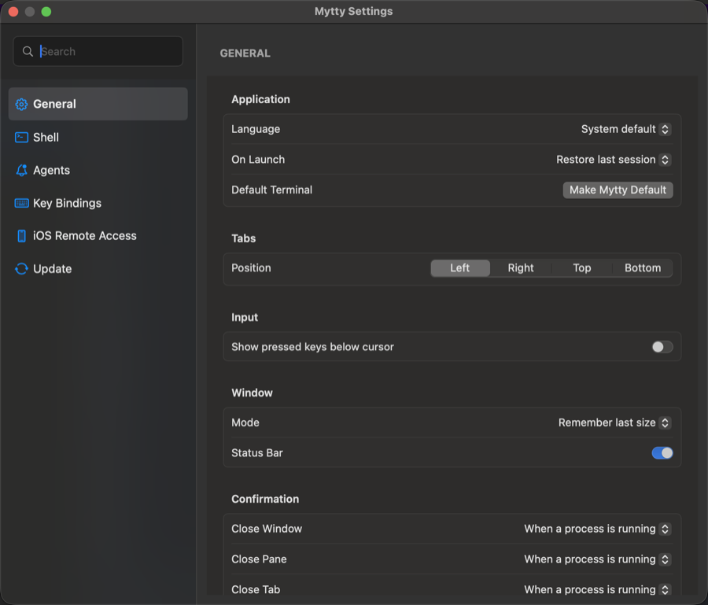
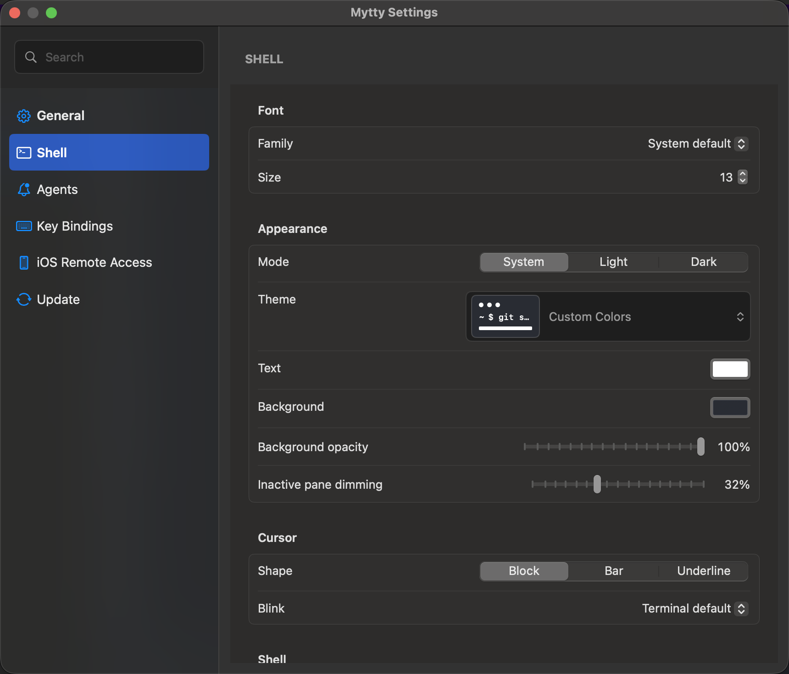
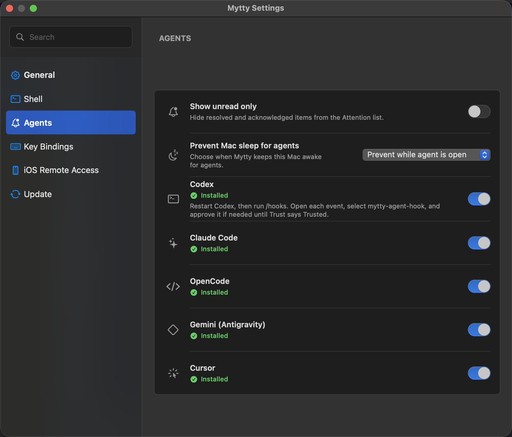
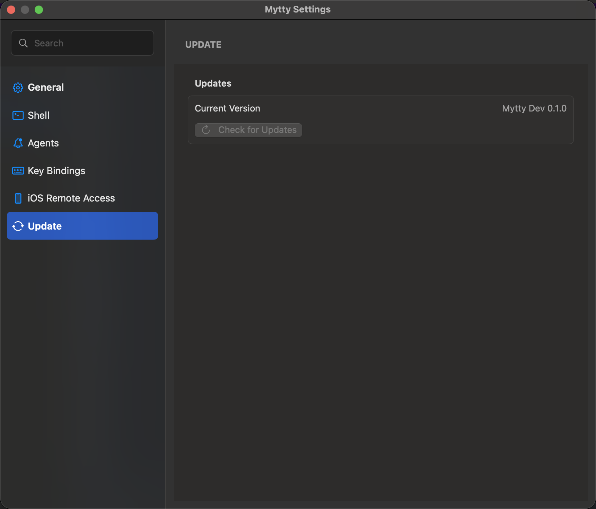

# Settings reference

Mytty's Settings window (Command-,) has six sections in the sidebar:
General, Shell, Agents, Key Bindings, Remote (labeled "iOS Remote Access"
in the sidebar), and Update. A search field
above the sidebar filters sections by title and by a fixed list of search
terms per section (for example typing "gemini" or "sleep" surfaces
Agents). This page lists every control in each section, its default value,
and where the value is persisted on disk. Source: `SettingsView.swift`,
`AgentIntegrationSettingsView.swift`, `RemoteAccessSettingsView.swift`,
`PreferencesStore.swift`.

For the full key binding list, see
[Keyboard shortcuts](keyboard-shortcuts.md).

## General

| Group | Control | Type | Default |
| --- | --- | --- | --- |
| Application | Language | Menu: System Default / English / Japanese | System Default |
| Application | On Launch | Menu: Restore last session / New window | Restore last session |
| Application | Default Terminal | Button: "Make Default" (hidden once Mytty is already `open`'s default handler) | not default |
| Tabs | Position | Segmented: Left / Right / Top / Bottom | Left |
| Input | Show pressed keys in pane | Toggle | Off |
| Window | Mode | Menu: Remember last size / Fullscreen / Small | Remember last size |
| Window | Status bar | Toggle | On |
| Confirmation | Close window | Menu: When process running / Always | When process running |
| Confirmation | Close pane | Menu: When process running / Always | When process running |
| Confirmation | Close tab | Menu: When process running / Always | When process running |
| Confirmation | Close last pane in window | Toggle | On |

## Shell

| Group | Control | Type | Default |
| --- | --- | --- | --- |
| Font | Family | Menu of installed font families | System Default (empty string) |
| Font | Size | Numeric field + stepper, range 6-72 | 13 |
| Appearance | Mode | Segmented: System / Light / Dark | System |
| Appearance | Theme | Ghostty theme picker | none (uses Text/Background colors below) |
| Appearance | Text / Background color | Color pickers, shown only when Theme is unset | Text `#FFFFFF`, Background `#282C34` |
| Appearance | Background opacity | Slider, range 0.2-1.0 | 1.0 (opaque) |
| Appearance | Inactive pane dimming | Slider, range 0-0.8 | 0.32 |
| Appearance | Active pane border | Toggle; the outline only appears in a split tab | On |
| Appearance | Border color | Color picker, shown only when the border is on | System accent color (empty string) |
| Appearance | Border width | Slider, range 1-6, shown only when the border is on | 2 |
| Cursor | Shape | Segmented: Block / Bar / Underline | Block |
| Cursor | Blink | Menu: Terminal Default / On / Off | Terminal Default (system) |
| Shell | Default login shell | Text field | empty (uses the user's login shell) |
| Autocomplete | Inline suggestions | Toggle | On |
| Autocomplete | Accept suggestion | Fixed label, not editable | Tab key |

## Agents

| Row | Control | Type | Default |
| --- | --- | --- | --- |
| Unread items only | Attention drawer filter | Toggle | Off |
| Prevent sleep while an agent runs | Sleep prevention mode | Menu: Allow sleep / Prevent while processing / Prevent while launched | Allow sleep |
| Teach agents about pane teams | Pane-team pointer for Claude Code and Codex | Toggle | On |
| Codex | Install hook integration | Toggle + status (Not Installed / Installed / Needs Repair) | Not Installed |
| Claude Code | Install hook integration | Toggle + status | Not Installed |
| OpenCode | Install hook integration | Toggle + status | Not Installed |
| Gemini (Antigravity) | Install hook integration | Toggle + status | Not Installed |
| Cursor | Install hook integration | Toggle + status | Not Installed |

Each provider row shows a status derived from the actual configuration
file on disk, not from whether the toggle was clicked: **Not Installed**,
**Installed**, or **Needs Repair** (the file exists but its mytty entries
were edited or partially removed outside the app). A **Needs Repair** row
shows a repair button that rewrites only mytty's own handlers. See
[Agent providers](agent-providers.md) for the file each toggle writes to
and [Install and verify agent integrations](../how-to/install-agent-integrations.md)
for the activation steps.

**Teach agents about pane teams** writes a short pointer into a provider's
global configuration -- a `~/.claude/skills/mytty-panes/SKILL.md` skill for
Claude Code, a managed block in `~/.codex/AGENTS.md` for Codex -- telling it
to run `mytty-ctl guide` when asked to coordinate work across panes or run
sub-agents. It only applies to providers whose hook integration above is
already installed, and follows that toggle automatically as providers are
installed or removed. Cursor, OpenCode, and Antigravity have no documented
place for a global pointer like this yet, so they're not covered.

## Key Bindings

A recordable row per command, grouped as Application, Tabs, Panes, and
Terminal Recording. The on-device model commands (Explain Pane,
Summarize Last Command, Compose One-Liner) only appear on macOS 26+.
Clicking a row's recorder field and pressing a key combination sets that
binding; pressing Delete while recording clears it. A row with a circular
arrow button resets that one command to its default. Conflicting bindings
are flagged inline, naming the other command that already uses the
combination. Full command and default list: [Keyboard shortcuts](keyboard-shortcuts.md).

## Remote

| Control | Type | Default |
| --- | --- | --- |
| Enable Remote Access | Toggle | Off |
| Pairing code | 6-digit code, generated on demand, with an expiry countdown and the listening port | not generated |
| Paired devices | List with Rename / Remove per device, each showing pairing date and push-registration status | empty |
| Enable Push Notifications | Toggle, shown once Remote Access is on | On |

The Pairing Code and Paired Devices sections only appear once **Enable
Remote Access** is on. See `docs/ios-remote.md`-adjacent explanation pages
for the pairing and secure-channel design.

## Update

| Control | Type | Notes |
| --- | --- | --- |
| Check for Updates | Button | Checks GitHub Releases. A plain click considers stable releases only |
| Check for Updates (Option-click) | Button (modified) | Also considers pre-releases (`x.y.z-beta.1`, `x.y.z-rc.N`, ...) and installs the newest one found |

Mytty also checks automatically at launch and when **About Mytty** is
opened; those automatic checks only ever consider stable releases. Before
replacing the app bundle, Mytty verifies the download digest, bundle
identifier and version, Developer ID team signature, nested code
signatures, and a Gatekeeper assessment. Automatic and manual self-update
are both disabled in Mytty Dev builds.

## Data storage locations

These are the release-build paths. Mytty Dev (`swift run Mytty`) uses the
parallel `mytty-dev` directories and a separate `com.m-tkg.mytty.dev`
control socket, and does not share settings, sessions, or usage cache
with an installed release. Provider hook installation is shared between
them, because the provider's own configuration file is global on disk;
only the event routing stays pane-scoped per build.

| Data | Location |
| --- | --- |
| Application settings (General/Agents/Remote/key bindings) | `~/.config/mytty/config.toml` |
| Terminal settings (Shell section) | `~/.config/mytty/terminal.conf` |
| Agent integration settings | `~/.config/mytty/agents.toml` |
| Sessions, events, and scheduled input | `~/Library/Application Support/mytty/` |
| Logs | `~/Library/Logs/mytty/` |

`config.toml` stores each setting under a stable key managed by Mytty
(for example `tab-position`, `on-launch`, `agents.prevent-system-sleep`,
`pane.inactive-dimming`, `pane.active-border` with its `-width` and
`-color` companions, and one `keybinding.<command>` entry per
customizable command). Lines outside these managed keys are preserved
verbatim on save. One managed key, `keybinding.toggle-attention`, is
reserved in the schema but not currently read or written by any code
path. The **Toggle Attention** menu command has no key equivalent wired
up in the shipped app, despite being present in the View menu.
