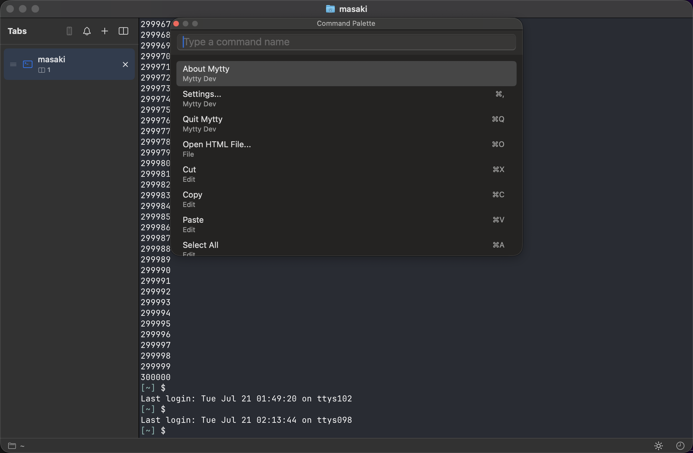

# Getting started with Mytty

日本語版は [getting-started_ja.md](getting-started_ja.md) にあります。

## Install Mytty

Mytty needs macOS 15 or later on Apple Silicon. Download the latest `Mytty.zip` from [Releases](https://github.com/m-tkg/Mytty/releases), unzip it, and drag `Mytty.app` into `/Applications`.

If you want to build it from source instead, see [Build the macOS app from source](../how-to/build-macos-app.md).

## Launch it

Double-click the Mytty app to launch it.

Command-Shift-P opens the command palette, from which you can run a wide range of commands. You can also use keyboard shortcuts or the menu bar.

## Windows, tabs, and panes

The area where a terminal is shown is called a pane. A window can hold multiple tabs, and each tab can be split into multiple panes.

**New Window** opens a new window.

**New Tab** opens a new tab.

**Split Right** creates a new pane to the right of the currently active pane.

A tab's panes can be split further, in any of the four directions.

Moving and swapping panes can also be done with keyboard shortcuts. Check Settings to see what's available and try a few out.

After closing a tab or pane, you can restore it from **Recently Closed Items**.

This only works while Mytty is running; quitting the app clears the history.

Once you have a lot of tabs and panes, opening **Show All Panes** lists every pane so you can jump straight to one.

## Status bar

The status bar follows whichever pane is focused, showing its working directory and, when the directory is under Git, the repository and branch.

Clicking the GitHub icon opens the repository's GitHub page.

Clicking the folder icon opens that directory in Finder.

When an AI agent is running, the status bar shows the agent name, model, and context/limit information.

Clicking the moon icon lets you toggle whether Mytty prevents sleep while an AI agent is running.

## Quit and relaunch

Quit Mytty while you still have tabs and panes open, then launch it again: tab state, pane layout, and any AI agent sessions are all restored.
