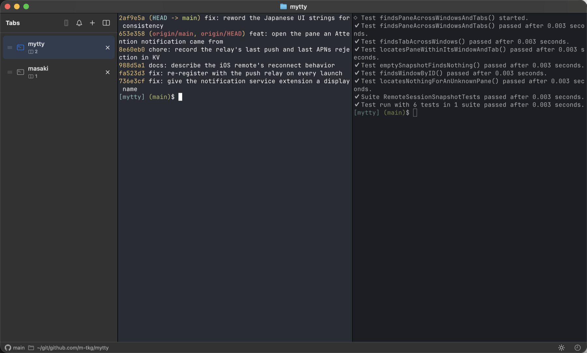
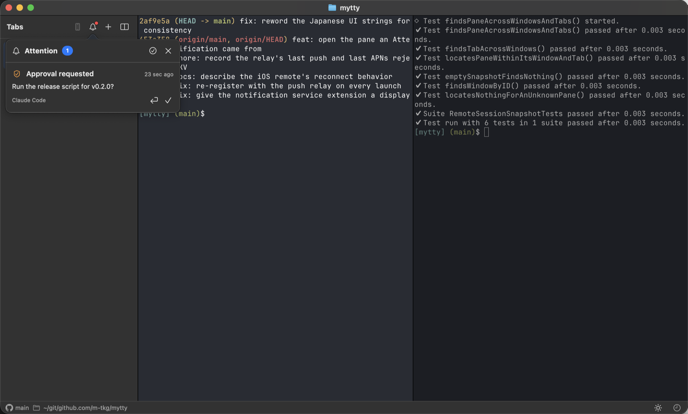

# Using Mytty

日本語版は [usage_ja.md](usage_ja.md) にあります。

A walk through what Mytty does day to day. For the exhaustive list of
settings and behaviours, see the [feature guide](../README.md#feature-guide);
this page covers the parts you will touch first.

## Getting it running

Mytty needs **macOS 15 or later on Apple Silicon**. Download `Mytty.zip` from
[Releases](https://github.com/m-tkg/Mytty/releases), unzip it, and move
`Mytty.app` to `/Applications`. Builds are signed and notarized, so it opens
without a Gatekeeper prompt. To build from source instead, see
[Building Mytty](building.md).

Nothing needs configuring to start: the first launch opens a window with your
login shell.

## Windows, tabs, and panes

Tabs live in a sidebar rather than a title bar strip, so long titles stay
readable and the list keeps its place as it grows. Each row shows how many
panes the tab holds. Drag a row to reorder it, or drag it out to make a new
window.

| What you want | How |
| --- | --- |
| New tab / window | Command-T / Command-N |
| Split right / down | Command-D / Command-Shift-D |
| Move between panes | Command-Option-Arrow |
| Zoom one pane to fill the tab | Control-Command-Return |
| Close a pane / tab | Command-Shift-W / Command-W |
| Reopen what you just closed | Command-Shift-T |
| Move the sidebar out of the way | Command-B |

The bar along the bottom follows the focused pane: its working folder, and the
repository and branch when it is inside a Git checkout.

If you would rather search than remember, **Command-Shift-P** opens a palette
over every menu command, filtered as you type.

Closing the app is not destructive. Windows, tabs, panes, split ratios and
working directories all come back on the next launch, and agent sessions come
back resumable.

## Working with agents

Mytty knows which pane an agent is talking from, and what it wants. That
knowledge comes from the agent itself: enabling a provider in
**Settings > Agents** installs hooks into that provider's own configuration,
and those hooks report structured events. Nothing is scraped from the screen,
so a request is never attributed to the wrong pane.

Codex, Claude Code, OpenCode, Gemini (Antigravity), and Cursor are supported.

While an agent runs, the sidebar row and the status bar show what it is doing —
the model in use, remaining context, session cost, and quota meters where the
provider exposes them.

When an agent needs something, it lands in the **Attention Inbox**
(Command-Shift-A): approval requests, questions, failures, and completions of
long-running work. Each entry names the pane it came from, and the arrow button
jumps straight there. Entries stay until you deal with them, so a request that
arrives while you are in another tab is still waiting when you come back.

macOS notifications cover the same ground while you are elsewhere on the Mac.
Mytty stays quiet when the pane is already in front of you.

Agents also tend to work longer than a screensaver timeout. **Settings >
General** can hold sleep off while an agent is running, or for as long as an
agent is open — including with the lid closed, via a bundled helper that needs
a one-time approval in System Settings.

### Letting an agent drive Mytty

`mytty-ctl` is a CLI that works inside any pane with no setup, and lets an
agent open and split panes, type into them, read their screens, and wait for
another pane's agent to go idle or need attention. The point is that a team of
subagents becomes real panes you can watch and interrupt, rather than something
invisible. See [mytty-ctl](mytty-ctl.md).

## Reaching your Mac from an iPhone

Turn on **Settings > iOS Remote Access**, press **Generate Pairing Code**, and
enter the six digits in the Mytty iOS app. The Mac is found over Bonjour; the
connection is paired and encrypted. Over a VPN such as Tailscale you can enter
the address directly instead.

From the phone you can browse windows, tabs and panes, watch a pane live in the
Mac's own colours, and type into it — Japanese composes through the iPhone's
own IME, and a key bar covers Ctrl, Option, arrows and the rest.

  
  

Attention items also arrive as push notifications, so a phone in your pocket
tells you an agent is stuck even with the remote app closed. Tapping the alert
opens the pane it came from. Alert text is encrypted on the Mac with the
pairing key and decrypted on the phone, so the relay that carries it never sees
what an agent said.

## Where to look next

- [Feature guide](../README.md#feature-guide) — every setting and behaviour
- [mytty-ctl](mytty-ctl.md) — driving Mytty from an agent
- [Agent integrations](agent-integrations.md) — what each provider reports
- [Building Mytty](building.md) — building, testing, and releasing
